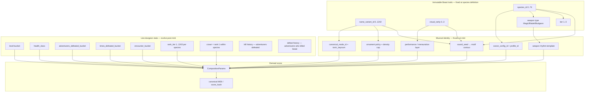

# Loot Survivor — Beast Trait → Musical Canon Mapping

Created: 2026-06-13  
Status: Design reference (vault)  
Tags: #loot-survivor #beasts #canon #generative-music #mapping #dark

Related: [[Loot Survivor - Beasts V3 Living Sound Technical Spec]], [[Melodic Canon]], [[Aesthetic Profiles]], [[00 - Composition Engine Index]]

---

## Purpose

This note defines **numerical bounds** for every Loot Beast trait dimension and maps each dimension onto **bounded musical parameters** in the Koji/Cairo composition engine. The goal is **93,225 unique canonical identities** — one distinct generative canon fingerprint per mintable Beast — while keeping the collection in a **dark harmonic world** drawn from curated diatonic, harmonic-minor, harmonic-major, and diminished modes.

Implemented key-cell target: `composition/beast_trait_map.cairo`. Full implementation target: `map_beast_traits_to_composition_params()` feeding a canonical-mode-aware composer and optional `ornamentation_v2`.

---

## Beast identity cardinality

Every mintable Beast is a unique tuple of **immutable onchain traits** at capture (level ≥ 19):

| Dimension | Count | Index range | Notes |
|-----------|------:|-------------|-------|
| **Species** | 75 | `0..74` | 15 apex (Tier 1) + 15×4 lower tiers |
| **Name variant** | 1,243 | `0..1242` | `0` = bare species name; `1..1242` = prefix × suffix grid |
| **Visual rarity** | 4 | `0..3` | Standard, Animated, Shiny, Animated+Shiny |
| **Total mintable** | **93,225** | — | `75 × 1,243 × 4` |

### Name variant decomposition

Each Beast name follows the structure: **`{prefix_part1} {prefix_part2} {species}`** — e.g. "Vengeance Growl Warlock". Both name parts come *before* the species name (not after it). A bare-name Beast has neither part: just "Warlock."

| Sub-trait | Vault variable | Count | Index | Roll weight (mint) |
|-----------|---------------|------:|-------|-------------------|
| Prefix part 1 | `prefix_id` | 69 | `0..68` | uniform |
| Prefix part 2 | `suffix_id` | 18 | `0..17` | uniform |
| Bare name (no affix) | `name_variant_id = 0` | 1 | — | included in 1,243 |

> **Terminology note:** The vault uses `prefix_id` and `suffix_id` as index variables. In-game, both are "prefix parts" (they precede the species name). The "suffix_id" drives ornament policy but does not function as a trailing suffix in the name.

```text
if name_variant_id == 0:
    prefix_id = NONE        // bare species name only
    suffix_id = NONE
else:
    idx = name_variant_id - 1          // 0..1241
    prefix_id = idx / 18               // 0..68  (prefix_part1 → key cell)
    suffix_id = idx % 18               // 0..17  (prefix_part2 → ornament policy)
```

Verify: `1 + 69 × 18 = 1,243` ✓ | `75 × 1,243 = 93,225` ✓

### Hidden combat trait (not in NFT title, in game data)

| Dimension | Count | Values |
|-----------|------:|--------|
| **Beast combat type** | 3 | Magic, Hunter (→ Blade weakness), Brute (→ Bludgeon weakness) |

Each Beast has a fixed combat type: **Magic**, **Hunter**, or **Brute**. The adventurer counters a Magic beast with a Magic weapon, a Hunter with a Blade weapon, a Brute with a Bludgeon weapon. The species table below lists the counter-weapon as the "Weakness" column.

Per the game source (`beast_definitions.cairo`), the 75 species are grouped in type order: species 0–24 are Magic type, species 25–49 are Hunter/Blade type, species 50–74 are Brute/Bludgeon type. The tier ordering (Tier 1 apex through Tier 5 common) is distributed across all three type groups.

Maps to rhythmic attack profile and harmonic aggression (see below). Derived from species definition, not from name roll.

### Visual rarity distribution (mint pool)

| `visual_rarity` | Label | Approx. share |
|----------------:|-------|---------------|
| 0 | Standard | 89.75% |
| 1 | Animated | 5.00% |
| 2 | Shiny | 5.00% |
| 3 | Animated + Shiny | 0.25% |

---

## Tier and species bounds

| Tier | Difficulty | Species count | Level to encounter | Mint at |
|------|------------|--------------:|-------------------|---------|
| 1 | Apex | 15 | high floor | ≥ 19 |
| 2 | Elite | 15 | mid-high | ≥ 19 |
| 3 | Dangerous | 15 | mid | ≥ 19 |
| 4 | Feral | 15 | low-mid | ≥ 19 |
| 5 | Common | 15 | entry (~7) | ≥ 19 |

`species_id → tier` is fixed (see species table below). Tier sets **canon complexity ceiling** (voice count, profile darkness, max phrase length).

---

## Uniqueness proof (design level)

Musical identity is **injective** from Beast traits when:

```text
beast_id_hash = Poseidon("LOOT_BEAST_SOUND_V1", chain_id, contract, token_id)

sound_seed = Poseidon(beast_id_hash, species_id, name_variant_id, visual_rarity)

canon_config_id     = SPECIES_TABLE[species_id].config_id          // 75 distinct rows
canonical_mode_id, tonic_pc = prefix_to_dark_key(prefix_id)        // 69 bounded key cells
ornament_policy     = SUFFIX_ORNAMENT_TABLE[suffix_id or default]  // 18 policies
performance_layer   = VISUAL_TABLE[visual_rarity]                  // 4 layers
motif_entropy       = extract_bits(sound_seed, …)                  // fine contour within cell

music_fingerprint = Poseidon(
  sound_seed, canon_config_id, canonical_mode_id, tonic_pc,
  ornament_policy_id, performance_layer_id,
  weapon_rhythm_id
)
```

Because `(species_id, name_variant_id, visual_rarity)` is unique per Beast, `sound_seed` is unique. Even when two Beasts share the same coarse canon family (same species), **prefix/suffix/visual** and **seed bits** diverge motif contour, phrase length micro-variation, register, and ornament plan — yielding distinct `get_score_hash` outputs.

**Coarse parameter space** (lower bound on distinguishable families):

```text
75 species configs
× 69 prefix key cells (mode × tonic × register band)
× 18 suffix ornament policies
× 4 visual performance layers
× 3 weapon rhythm profiles
= 2,801,880 ≥ 93,225 ✓
```

Fine-grained seed entropy inside each cell provides the remaining uniqueness for motif steps and LCG tie-breaks.

---

## Mapping architecture (trait layers → music layers)



Immutable traits define **who the Beast is musically**. Living stats (from [[Loot Survivor - Beasts V3 Living Sound Technical Spec#Suggested stat-to-music mapping]]) modulate density, tension, and instrumentation without re-rolling the seed.

---

## Dark key policy

Loot Survivor is a dark dungeon. Prefix-driven tonality uses the canonical `Modes` registry and the curated `is_dark_mode()` designation. A mode can contain a minor third without belonging to the curated Beast palette; `has_minor_third()` exposes that structural fact separately.

The dark palette draws from three parent-scale **families** plus both diminished scales. It excludes Ionian, Lydian, Mixolydian, whole tone, and functionally dominant altered scales.

| `canonical_mode_id` | Parent family | Mode | Formula | Dark role |
|--------------------:|---------------|------|---------|-----------|
| 4 | Diatonic major | Dorian | `1 2 b3 4 5 6 b7` | Warmest minor color; lifted 6th |
| 7 | Diatonic major | Aeolian | `1 2 b3 4 5 b6 b7` | Natural-minor grief |
| 5 | Diatonic major | Phrygian | `1 b2 b3 4 5 b6 b7` | Immediate b2 gravity |
| 6 | Diatonic major | Locrian | `1 b2 b3 4 b5 b6 b7` | Unstable diminished tonic |
| 8 | Harmonic minor | Harmonic Minor | `1 2 b3 4 5 b6 7` | Dramatic leading-tone tension |
| 26 | Harmonic minor | Dorian #4 | `1 2 b3 #4 5 6 b7` | Mystical, cinematic tritone color |
| 27 | Harmonic minor | Locrian natural 6 | `1 b2 b3 4 b5 6 b7` | Half-diminished darkness with lifted 6th |
| 20 | Harmonic major | Dorian b5 / Dorian-Locrian | `1 2 b3 4 b5 6 b7` | Dorian lift against a diminished 5th |
| 21 | Harmonic major | Phrygian b4 | `1 b2 b3 b4 5 b6 b7` | Claustrophobic lower-degree cluster |
| 29 | Symmetric diminished | Half-whole diminished | `1 b2 b3 3 #4 5 6 b7` | Altered-dominant suspense |
| 30 | Symmetric diminished | Whole-half diminished | `1 2 b3 4 b5 b6 bb7 7` | Fully diminished, rotating instability |

### Canonical family additions

All harmonic-major rotations are available even when they are not selected by the Beast dark palette:

| `canonical_mode_id` | Harmonic-major mode | Formula |
|--------------------:|---------------------|---------|
| 19 | Harmonic Major | `1 2 3 4 5 b6 7` |
| 20 | Dorian b5 / Dorian-Locrian | `1 2 b3 4 b5 6 b7` |
| 21 | Phrygian b4 | `1 b2 b3 b4 5 b6 b7` |
| 22 | Lydian b3 | `1 2 b3 #4 5 6 7` |
| 23 | Mixolydian b2 | `1 b2 3 4 5 6 b7` |
| 24 | Lydian augmented #2 | `1 #2 3 #4 #5 6 7` |
| 25 | Locrian bb7 | `1 b2 b3 4 b5 b6 bb7` |

Whole tone is canonical mode `28`: `1 2 3 #4 #5 b7`. It contains only whole steps and has no minor third, so it is ambiguous and floating rather than part of the curated dark/minor palette.

**Correctness note:** both diminished scales alternate half and whole steps and contain many tritones. The “zero half steps” property belongs to whole tone, not diminished.

Chromatic configs (profiles 1–24, configs 7–42) use **`tonic_pc` on semitone lattice** with the same dark root pool.

### Dark tonic pool (12 pitch classes)

All roots are valid; register band shifts MIDI tonic into dungeon registers:

| Register band | MIDI tonic range | Feel |
|---------------|------------------|------|
| `LOW` | 36–47 (C2–B2) | Subterranean, colossal |
| `MID` | 48–59 (C3–B3) | Default dungeon floor |
| `HIGH` | 60–71 (C4–B4) | Rare — only Tier 5 + specific suffixes |

```text
tonic_keynum = 36 + tonic_pc + (register_band × 12)
tonic_pc     = prefix_id % 12
register_band = (prefix_id / 12) % 3   // 69 prefixes → 12×3 cells with 3 spare
mode         = dark_mode_at(prefix_id % dark_mode_count())
canonical_mode_id = mode_to_id(mode)
```

Bare-name Beasts (`name_variant_id = 0`) use **Phrygian** (`canonical_mode_id = 5`), `tonic_pc = species_id % 12`, and a bounded tier register: tiers 1–2 `LOW`, tiers 3–4 `MID`, tier 5 `HIGH`.

> **Integration guard:** `MelodicCanon.mode_id` currently uses a separate six-diatonic-mode numbering and applies `% 6`. Never pass `canonical_mode_id` into that field until the melodic-canon realization path is migrated to the canonical variable-length mode system; doing so would silently select the wrong scale.

---

## Familiar dark modes vs exotic palette — design implications

You will likely **narrow** the Beast key policy to modes the ear recognizes quickly: natural minor, Phrygian, Dorian, and maybe harmonic minor. The full `is_dark_mode()` registry in `modes.cairo` currently lists **11** modes; many of the later entries (harmonic-major rotations, symmetric diminished, harmonic-minor modes 2/4) are **dark on paper** but **unfamiliar in the ear** — the same problem as leaning on **melodic minor** and its seven rotations.

This section sketches what changes if you **avoid most melodic-minor-family modes** and cap exotic modes to apex tiers only.

### Mode taxonomy (three buckets)

| Bucket | Modes | Ear familiarity | Beast policy (recommended) |
|--------|-------|-----------------|---------------------------|
| **A — Core familiar** | Aeolian, Phrygian, Dorian | High — film/game/minor-key common practice | **Default for tiers 3–5**; majority of prefix cycle |
| **B — Extended dark** | Harmonic minor, Locrian | Medium — gothic/classical leading tone; Locrian is unstable | **Tier 2–3** suffix-driven; rare on commons |
| **C — Exotic tension** | Dorian ♯4, Locrian ♮6, Dorian ♭5, Phrygian ♭4, half/whole diminished | Low — jazz theory, not dungeon instinct | **Tier 1 apex only** (optional); test before shipping |
| **D — Excluded** | Melodic minor + all 7 rotations; Ionian/Lydian/Mixolydian; whole tone; altered/Lydian dominant | Wrong vibe or too “jazz bright” | **Never** in Beast prefix policy |

#### Why melodic minor is a poor fit (even though it is “minor”)

Melodic minor (`1 2 b3 4 5 6 7`) and its rotations (Dorian ♭2, Lydian augmented, Lydian dominant, Altered, etc.) live in **`modes.cairo`** but are **not** in `is_dark_mode()` today. Keep it that way for Beasts.

| Property | Aeolian / Phrygian | Melodic minor |
|----------|-------------------|---------------|
| Upper tetrachord | `b6 b7` — settled grief | `6 7` — **major brightness** on 6 and 7 |
| Cadential feel | Plagal/minor authentic | Functional major V → i in minor |
| Genre association | Dungeon, folk horror, metal | Jazz, fusion, “smart” harmony |
| Ornament expectations | Neighbor tones around minor 3rd | Altered dominants, ♯11 lines |
| Player read at 30s loop | Immediate “minor key” | “Why did it go major?” |

**Implication:** melodic minor is not “more minor”; it is **minor tonic with major upper scale** — cognitively closer to **heroic/sophisticated** than **Loot Survivor dread**. The harmonic-minor parent (`… b6 7`) keeps darkness *and* a familiar leading tone without importing the jazz-minor bundle.

Similarly, **harmonic-major rotations** (Phrygian ♭4, Lydian ♭3, Mixolydian ♭2) are mathematically dark but **not musically familiar** — players cannot name them, only feel “wrong notes.”

### Current code vs proposed familiar subset

**Today** (`dark_mode_at`, count = 11):

```text
0 Dorian → 1 Aeolian → 2 Phrygian → 3 Locrian → 4 HarmonicMinor
→ 5 DorianSharp4 → 6 LocrianNatural6 → 7 DorianFlat5 → 8 PhrygianFlat4
→ 9 HalfWholeDim → 10 WholeHalfDim
```

**Proposed `familiar_mode_at`** (count = 4, tiers 3–5 default):

```text
0 Aeolian → 1 Phrygian → 2 Dorian → 3 HarmonicMinor
```

**Proposed extended add-on** (tier 1–2 only, count +3 → 7 total):

```text
4 Locrian → 5 DorianSharp4 → 6 HalfWholeDiminished
```

Drop from Beast rotation unless A/B tests pass: Locrian ♮6, Dorian ♭5, Phrygian ♭4, whole–half dim (most alien).

```cairo
// Sketch — separate from full is_dark_mode() registry
pub fn familiar_mode_count() -> u8 { 4 }

pub fn familiar_mode_at(index: u8) -> Modes {
    let i = index % familiar_mode_count();
    if i == 0 { Modes::Aeolian(()) }
    else if i == 1 { Modes::Phrygian(()) }
    else if i == 2 { Modes::Dorian(()) }
    else { Modes::HarmonicMinor(()) }
}
```

`prefix_to_dark_key` would call `familiar_mode_at` for tiers ≥ 3, and `extended_dark_mode_at(tier, prefix_id)` for tiers 1–2.

### Implications matrix

| Concern | Full 11-mode palette | Familiar 4-mode default | Mitigation |
|---------|---------------------|-------------------------|------------|
| **93,225 uniqueness** | 69 prefixes × 11 modes × 12 tonics | 69 × **4** × 12 — **more prefix collisions on mode** | Uniqueness lives in `sound_seed` + motif walk, not mode alone — **still safe** |
| **Coarse key cells** | 69 × 11 = 759 mode-tonic-register combos | 69 × 4 = 276 (+ tier gating) | Still **≫ 93k** when × species × suffix × visual |
| **Audible sameness risk** | Unfamiliar modes mask repetition | **Fewer modes → more “same key” Beasts** | Weight **Phrygian/Aeolian** heavier in cycle; vary **tonic_pc + register** aggressively |
| **Prefix formula** | `prefix_id % 11` | `prefix_id % 4` (or tier-aware) | Map prefix ranges to fixed modes (see below) |
| **Species/config alignment** | Phrygian profile + Dorian key = friction | Force **profile ↔ mode** consistency table | e.g. `config 29 phrygian` → key cell must be Phrygian or Aeolian |
| **Renaissance configs 0–6** | Legacy `MelodicCanon.mode_id` (6 diatonic) | Aeolian/Phrygian/Dorian **map cleanly** | Harmonic minor needs canonical realization path before use |
| **Chromatic stacks (7–42)** | Mode is **tonic anchor** only | Same — stacks define verticals | Exotic parent modes **less audible**; still prefer familiar tonic |
| **Ornament v1/v2** | Avoid-note rules assume tertian minor | **Best on Aeolian/Phrygian** | Harmonic minor: watch **aug2** (b6→7) in neighbor fills |
| **Metadata trait** | `"Dark Key": "Phrygian b4"` | `"Dark Key": "Phrygian (E)"` | Familiar names improve marketplace readability |
| **Testing load** | 11 modes × 12 roots = 132 cells | **48 core cells** + 21 apex | Focus listening tests on 48; spot-check apex |

### Prefix mapping under familiar-first policy

Instead of cycling all dark modes uniformly, **assign prefix ranges to fixed familiar modes** so names carry semantic weight:

| `prefix_id` range | Mode (fixed) | Rationale |
|-------------------|--------------|-----------|
| 0–16 | **Phrygian** | Torment/Pain/Demon — immediate ♭2 |
| 17–33 | **Aeolian** | Shadow/Gloom/Blood — pure minor |
| 34–50 | **Dorian** | Hunt/Stalk/Moon — uncanny, not hopeless |
| 51–58 | **Harmonic minor** | Curse/Doom — leading-tone drama |
| 59–68 | **Phrygian or Aeolian** (alternate) | Whisper/Bane — return to core |

Within each range, `tonic_pc = prefix_id % 12` and register bands unchanged.

**Bare-name Beasts:** keep **Phrygian** default (already in `bare_name_dark_key`).

### Tier gating (recommended)

```text
tier 5–4 (common/feral):  familiar_mode_at only     // Aeolian, Phrygian, Dorian, HarmonicMinor
tier 3:                   familiar + Locrian
tier 2:                   familiar + Locrian + Dorian♯4
tier 1 (apex):            full extended_dark subset   // optional dim; still NO melodic minor
```

This concentrates **ear training** on the bulk of the mint pool (tiers 4–5 are 30 species × 1,243 × 4 ≈ **37k** Beasts).

### Interaction with aesthetic profiles

| Profile family | Best key modes | Avoid |
|----------------|----------------|-------|
| `phrygian` (19) | Phrygian, Aeolian | Dorian (loses ♭2 gravity), melodic minor |
| `bitonal` (18) | Any familiar + chromatic stack | — |
| `octatonic` / `dom_alt` (8–10) | Harmonic minor, half–whole dim | Aeolian-only realization |
| Renaissance 0–6 | Aeolian, Dorian, Phrygian | Locrian (tritone tonic) |
| `penta_open` / smooth (20–22) | Dorian, Aeolian | Phrygian ♭4, Locrian |
| Ligeti / cluster (5–6, 15) | Mode less important — **white-key or chromatic** | Do not tie to melodic minor parent |

**Rule:** when `profile_has_hard_material_gate(profile_id)`, **mode must agree with pitch gate** or realization uses chromatic lattice with dark `tonic_pc` only (current Qilin/Lydian maj9 override pattern).

### What you give up by avoiding exotic modes

- **Less “theoretical” variety** in prefix-driven mode slot — ~7 of 11 current dark modes unused for most Beasts.
- **Apex beasts** may sound less “alien” unless chromatic **canon configs** (bitonal, octatonic, ligeti) carry the weirdness instead of parent mode.
- **Diminished parent scales** no longer appear as key — but **octatonic axis configs** still provide diminished color in the vertical stack.

### What you gain

- **Faster listener parsing** — minor key identity in the first loop.
- **Safer ornamentation** — v2 suspensions/neighbors align with common-practice minor expectations.
- **Fewer bad test surprises** — melodic minor’s major 6th/7th won’t fight “dark dungeon” brief.
- **Simpler copy** — metadata `"Aeolian in A"` vs `"Locrian natural 6 in F#."`
- **Easier migration** from legacy `MelodicCanon.mode_id` (6 diatonic modes) to canonical modes.

### Melodic minor explicitly out of scope

The **`Modes::MelodicMinor`** family in `modes.cairo` remains available for **other compositions** (Barry Harris, jazz improv canon, Messiaen demos) but should be **blocked at the Beast mapper boundary**:

```cairo
fn beast_allowed_mode(mode: Modes) -> bool {
    if !is_dark_mode(mode) { return false; }
    // Block entire melodic-minor parent family
    match mode {
        Modes::MelodicMinor(()) | Modes::DorianFlat2(()) | Modes::LydianAugmented(())
        | Modes::LydianDominant(()) | Modes::MixolydianFlat13(()) | Modes::LocrianNatural2(())
        | Modes::Altered(()) => false,
        _ => true,
    }
}
```

For a **familiar-only** policy, further restrict to `familiar_mode_at` ∪ tier-gated extended list.

### Listening-test checklist (before freezing policy)

1. **30-second loop test** — Aeolian vs Phrygian vs Dorian vs harmonic minor on same canon skeleton; confirm Phrygian reads “darkest” without confusion.
2. **Ornament density** — dense v2 on harmonic minor: does aug2 (b6–7) sound intentional or broken?
3. **Tier 5 species** (Wolf, Skeleton) — must never land on Locrian or dim parent; confirm mapper.
4. **Same species, different prefix** — mode change audible enough that prefix affix feels meaningful.
5. **Reject criterion:** playtester says “this went major” or “jazz scale” → mode goes to excluded bucket.

### Cardinality after narrowing (still sufficient)

```text
Familiar-only prefix modes:     4
× tonic_pc:                    12
× register_band:               3
× prefix slots:                69
= 9,936 coarse key cells

× 75 species configs
× 18 suffix ornament policies
× 4 visual layers
× motif_seed (felt252)
≫ 93,225 ✓
```

Mode narrowing **does not** threaten Beast uniqueness; it trades **harmonic unfamiliarity** for **recognizable minor darkness**. Exotic color should come from **canon profile** (bitonal, octatonic, cluster) and **motif entropy**, not from melodic minor or obscure harmonic-major modes.

---

## Species → canon family (75 rows)

Each species maps to one **primary canon config** from the dark palette ([[Aesthetic Profiles#Config catalogue (43 configs)|43 configs]], 25 profiles]). Voice count follows config; tier caps maximum voices applied at render.

| Tier | Voice ceiling | Allowed profile families |
|------|---------------|--------------------------|
| 1 | 4 | phrygian, bitonal, octatonic, dom_alt, per_tonos, ligeti_micro, bartok_axis, cluster_soft |
| 2 | 4 | phrygian, neo_riem, octatonic, impr_add6, hindemith, sus_quartal |
| 3 | 3–4 | phrygian, aeolian/dorian diatonic, hindemith, penta_open, quartal |
| 4 | 2–3 | phrygian, penta_open, quartal, renaissance fifth-below |
| 5 | 2–3 | penta_smooth, penta_open, renaissance octave/unison |

### Full species table

`config_id` references `profiled_config_by_id` in `melodic_canon.cairo`. Generator helpers in parentheses.

#### Tier 1 — Apex (species 0–14)

| id | Species | Weakness | config_id | Profile / canon | Harmonic character |
|---:|---------|----------|----------:|-----------------|-------------------|
| 0 | Warlock | Magic | 18 | dom_alt_b9 (8) | Altered dominant — occult fire |
| 1 | Typhon | Bludgeon | 20 | oct_axis (10) | Octatonic axis — storm entropy |
| 2 | Jiangshi | Magic | 29 | phrygian 4v (19) | Phrygian cadential — undead hop |
| 3 | Anansi | Magic | 28 | bitonal 4v (18) | C vs F# split — trickster |
| 4 | Basilisk | Blade | 25 | cluster_soft (15) | Soft chromatic cluster — petrifying |
| 5 | Griffin | Blade | 24 | bartok_axis (14) | Minor-third axis — aerial hunt |
| 6 | Manticore | Blade | 18 | dom_alt_b9 (8) | Poison sting dominant |
| 7 | Phoenix | Magic | 26 | per_tonos (16) | Modulating maj7 drift — rebirth |
| 8 | Dragon | Magic | 15 | ligeti_micro (6) | Semitone micropolyphony |
| 9 | Minotaur | Blade | 12 | hindemith4 (4) | Labryinth mixed tension |
| 10 | Kraken | Bludgeon | 20 | oct_axis (10) | Deep diminished axis |
| 11 | Colossus | Bludgeon | 11 | quartal4_stack (2) | Quartal mass |
| 12 | Balrog | Magic | 15 | ligeti_micro (6) | Inferno cluster |
| 13 | Leviathan | Bludgeon | 10 | quartal_stack (2) | Abyssal fourths |
| 14 | Tarrasque | Bludgeon | 14 | ligeti_cluster (5) | Diatonic cluster band |

#### Tier 2 — Elite (species 15–29)

| id | Species | Weakness | config_id | Profile / canon |
|---:|---------|----------|----------:|-----------------|
| 15 | Ammit | Blade | 29 | phrygian 4v |
| 16 | Behemoth | Bludgeon | 12 | hindemith4 |
| 17 | Chimera | Magic | 28 | bitonal 4v |
| 18 | Chupacabra | Blade | 21 | sus_quartal |
| 19 | Gorgon | Magic | 25 | cluster_soft |
| 20 | Hydra | Bludgeon | 31 | neo_riem 3v |
| 21 | Juggernaut | Bludgeon | 11 | quartal4_stack |
| 22 | Kitsune | Magic | 27 | impr_add6 4v |
| 23 | Lich | Magic | 18 | dom_alt_b9 |
| 24 | Nephilim | Bludgeon | 24 | bartok_axis |
| 25 | Nue | Magic | 36 | neo_riem 4v |
| 26 | Qilin | Magic | 17 | lydian_maj9 → **override mode Aeolian** |
| 27 | Skinwalker | Blade | 34 | phrygian 3v |
| 28 | Titan | Bludgeon | 10 | quartal_stack |
| 29 | Wendigo | Blade | 29 | phrygian 4v |

#### Tier 3 — Dangerous (species 30–44)

| id | Species | Weakness | config_id | Profile / canon |
|---:|---------|----------|----------:|-----------------|
| 30 | Banshee | Magic | 34 | phrygian 3v |
| 31 | Cyclops | Bludgeon | 5 | three_5a_8vb (Renaissance) |
| 32 | Draugr | Blade | 1 | fifth_below |
| 33 | Ettin | Bludgeon | 4 | three_5b_8va |
| 34 | Giant | Bludgeon | 12 | hindemith4 |
| 35 | Harpy | Blade | 2 | octave_above |
| 36 | Jotunn | Bludgeon | 11 | quartal4_stack |
| 37 | Oni | Blade | 29 | phrygian 4v |
| 38 | Pegasus | Blade | 30 | penta_open 4v |
| 39 | Rakshasa | Magic | 28 | bitonal 4v |
| 40 | Roc | Blade | 35 | penta_open 3v |
| 41 | Vampire | Blade | 29 | phrygian 4v |
| 42 | Werewolf | Blade | 1 | fifth_below |
| 43 | Weretiger | Blade | 30 | penta_open 4v |
| 44 | Wyvern | Blade | 21 | sus_quartal |

#### Tier 4 — Feral (species 45–59)

| id | Species | Weakness | config_id | Profile / canon |
|---:|---------|----------|----------:|-----------------|
| 45 | Berserker | Blade | 0 | fifth_above |
| 46 | Direwolf | Blade | 1 | fifth_below |
| 47 | Ent | Bludgeon | 4 | three_5b_8va |
| 48 | Fenrir | Blade | 42 | jazz_improv 3v (dark turnaround) |
| 49 | Ghoul | Blade | 3 | unison |
| 50 | Goblin | Blade | 0 | fifth_above |
| 51 | Golem | Bludgeon | 10 | quartal_stack |
| 52 | Hippogriff | Blade | 2 | octave_above |
| 53 | Jaguar | Blade | 35 | penta_open 3v |
| 54 | Kappa | Bludgeon | 21 | sus_quartal |
| 55 | Nemeanlion | Blade | 30 | penta_open 4v |
| 56 | Satori | Magic | 39 | penta_smooth 4v |
| 57 | Sprite | Magic | 40 | penta_smooth 3v |
| 58 | Wraith | Magic | 34 | phrygian 3v |
| 59 | Yeti | Bludgeon | 35 | penta_open 3v |

#### Tier 5 — Common (species 60–74)

| id | Species | Weakness | config_id | Profile / canon |
|---:|---------|----------|----------:|-----------------|
| 60 | Bear | Bludgeon | 39 | penta_smooth 4v |
| 61 | Bigfoot | Bludgeon | 40 | penta_smooth 3v |
| 62 | Fairy | Magic | 40 | penta_smooth 3v |
| 63 | Gnome | Magic | 3 | unison |
| 64 | Kelpie | Magic | 1 | fifth_below |
| 65 | Leprechaun | Magic | 0 | fifth_above |
| 66 | Mantis | Blade | 3 | unison |
| 67 | Ogre | Bludgeon | 4 | three_5b_8va |
| 68 | Orc | Blade | 0 | fifth_above |
| 69 | Pixie | Magic | 40 | penta_smooth 3v |
| 70 | Rat | Blade | 3 | unison |
| 71 | Skeleton | Blade | 1 | fifth_below |
| 72 | Spider | Blade | 3 | unison |
| 73 | Troll | Bludgeon | 4 | three_5b_8va |
| 74 | Wolf | Blade | 1 | fifth_below |

> **Note:** Config 17 (lydian_maj9) appears only for Qilin — force canonical Aeolian (`canonical_mode_id = 7`) and a dark `tonic_pc` at realization so the profile's pitch gate stays bright-safe while the root stays minor.

---

## Prefix part 1 → key cell (69 prefixes)

Prefix_part1 sets **mode**, **tonic pitch class**, and **register band**. These are the actual game names in source order (`beast_definitions.cairo` index 0–68):

```
 0 Agony        1 Apocalypse   2 Armageddon   3 Beast        4 Behemoth
 5 Blight       6 Blood        7 Bramble       8 Brimstone    9 Brood
10 Carrion      11 Cataclysm  12 Chimeric     13 Corpse      14 Corruption
15 Damnation   16 Death       17 Demon        18 Dire        19 Dragon
20 Dread       21 Doom        22 Dusk         23 Eagle       24 Empyrean
25 Fate        26 Foe         27 Gale         28 Ghoul       29 Gloom
30 Glyph       31 Golem       32 Grim         33 Hate        34 Havoc
35 Honour      36 Horror      37 Hypnotic     38 Kraken      39 Loath
40 Maelstrom   41 Mind        42 Miracle      43 Morbid      44 Oblivion
45 Onslaught   46 Pain        47 Pandemonium  48 Phoenix     49 Plague
50 Rage        51 Rapture     52 Rune         53 Skull       54 Sol
55 Soul        56 Sorrow      57 Spirit       58 Storm       59 Tempest
60 Torment     61 Vengeance   62 Victory      63 Viper       64 Vortex
65 Woe         66 Wrath       67 Lights       68 Shimmering
```

Semantic clusters mapped to dark key cells:

| prefix_id range | Actual names (sample) | mode selection | register | Musical intent |
|-----------------|----------------------|----------------|----------|----------------|
| 0–11 | Agony, Apocalypse, Armageddon, Beast, Behemoth, Blight, Blood, Bramble, Brimstone, Brood, Carrion, Cataclysm | Phrygian | LOW | Sub-bass catastrophe — immediate ♭2 |
| 12–23 | Chimeric, Corpse, Corruption, Damnation, Death, Demon, Dire, Dragon, Dread, Doom, Dusk, Eagle | Phrygian | LOW | Fatalistic — undead/demonic gravity |
| 24–35 | Empyrean, Fate, Foe, Gale, Ghoul, Gloom, Glyph, Golem, Grim, Hate, Havoc, Honour | Aeolian | MID | Classic dungeon dread — natural minor |
| 36–47 | Horror, Hypnotic, Kraken, Loath, Maelstrom, Mind, Miracle, Morbid, Oblivion, Onslaught, Pain, Pandemonium | Aeolian | MID | Chaos and violation — pure minor grief |
| 48–59 | Phoenix, Plague, Rage, Rapture, Rune, Skull, Sol, Soul, Sorrow, Spirit, Storm, Tempest | Dorian | MID | Elemental and spiritual — lifted 6th flicker |
| 60–68 | Torment, Vengeance, Victory, Viper, Vortex, Woe, Wrath, Lights, Shimmering | Aeolian / Phrygian (alt) | HIGH | Final terror — high register fragility |

> **Note:** "Lights" and "Shimmering" (ids 67–68) are genuine game prefix_part1 names despite the lighter connotation. They occupy the HIGH register band; the Aeolian/Phrygian key still keeps them dark. "Shimmering" in HIGH Phrygian is unsettling, not cheerful.

Contract formula (deterministic, no string storage onchain):

```cairo
let key = prefix_to_dark_key(prefix_id);
// key.mode, key.canonical_mode_id, key.tonic_pc, key.register_band
```

---

## Prefix part 2 → ornamentation policy (18 name suffixes)

> **Naming note (from dev):** A Beast's full name is `{prefix_part1} {prefix_part2} {species}` — e.g. "Vengeance Growl Warlock". What this vault calls "prefix" (69 options) is **prefix_part1**; what this vault calls "suffix" (18 options) is **prefix_part2**. Neither comes after the species name. The `suffix_id` variable retained below refers to prefix_part2 index (0–17).

Prefix_part2 selects **ornament engine path** and **density cap**. Maps to v1 subdivision (`plan_ornament_subdivisions_*`) and/or v2 ornament clusters (`ornamentation_v2`, 35 kinds).

Actual game prefix_part2 names (from `beast_definitions.cairo`):
`Bane, Root, Bite, Song, Roar, Grasp, Instrument, Glow, Bender, Shadow, Whisper, Shout, Growl, Tear, Peak, Form, Sun, Moon`

| suffix_id | Prefix part 2 | v1 policy | v2 ornament cluster | density cap (0–7) | Character |
|----------:|--------------|-----------|---------------------|------------------:|-----------|
| 0 | Bane | structural | none / pedal_hold | 0 | Condemned — bare, inexorable |
| 1 | Root | structural | pedal hold, low sustain | 1 | Anchored — immovable, grounded |
| 2 | Bite | dense | appoggiatura, escape | 5 | Fanged — short, stabbing accents |
| 3 | Song | light | neighbor, passing | 3 | Lyrical — conjunct color, singing line |
| 4 | Roar | dense | acciaccatura + trill | 7 | Thunderous — apex ornament violence |
| 5 | Grasp | dense | suspension 4–3, 7–6 | 4 | Clutching — held dissonance resolving |
| 6 | Instrument | light | echappée, cambiata | 3 | Mechanical — deliberate non-chord notes |
| 7 | Glow | light | upper neighbor | 2 | Shimmer — high register halo |
| 8 | Bender | dense | chromatic approach, enclosure | 6 | Chromatic — bent-note enclosure lines |
| 9 | Shadow | structural | mordent only | 1 | Lurking — brief flicker, then silence |
| 10 | Whisper | light | passing, neighbor | 2 | Ghostly — soft scalar fill |
| 11 | Shout | dense | acciaccatura, sforzando | 5 | Piercing — sudden loud intrusion |
| 12 | Growl | dense | arpeggiation down | 4 | Threatening — low-register descent |
| 13 | Tear | light | retardation, suspension | 3 | Mourning — falling delay-resolution pairs |
| 14 | Peak | dense | trill, turn | 6 | Climactic — ornate apex flourish |
| 15 | Form | structural | ORN_FILL_STRUCTURAL | 0 | Austere — structure only, zero fill |
| 16 | Sun | light | double neighbor | 2 | Radiant — oscillating neighbor pair |
| 17 | Moon | dense | all_enabled (filtered dark) | 7 | Transcendent — full dark ornament palette |

Bare-name Beasts (`name_variant_id = 0`) use prefix_part2 defaults: **structural-only**, density **1**.

Smooth profiles (penta_smooth, impr_smooth) honor `ornament_structural_only` — density caps still apply but v2 chromatic fill is suppressed.

---

## Visual rarity → performance layer (4 variants)

| visual_rarity | NFT label | Tempo modifier | Ornament render | Extra engine flags |
|--------------:|-----------|----------------|-----------------|-------------------|
| 0 | Standard | `tempo_bpm = 72 + (seed % 24)` | v1 default | — |
| 1 | Animated | `tempo_bpm` + sine rubato (`remap_events_with_timing_wave`) | v1 dense | Mensuration pulse |
| 2 | Shiny | fixed tempo | v2 `profile_common_practice` | Velocity shimmer +2 |
| 3 | Animated + Shiny | rubato + shimmer | v2 dense + v1 overlay | `generate_ligeti_mensuration` optional on tier 1 |

Shiny variants may shift timbre offchain (harmonic sparkle) but **do not** change canonical pitch content — only performance metadata and velocity tables.

---

## Weapon weakness → rhythm & harmony modifier (3 types)

| Weakness | Adventurer counter-weapon | Rhythm template | Harmonic aggression |
|----------|---------------------------|-------------------|---------------------|
| Blade | Blade | Staccato structural grid (time_unit = 1) | Sharp dissonance budget +1 tier on strong beats |
| Bludgeon | Bludgeon | Heavy time_unit = 2 on follower voices | Low register weight +2 semitones |
| Magic | Magic | Syncopated entry-lag canon (`entry_lag_canon`) | Chromatic ornament admission +1 |

```text
weapon_rhythm_id = species_table[species_id].weakness
```

---

## Phrase length, density, and seed bit layout

Base phrase length from tier + seed:

```text
base_length = TIER_BASE_LEN[tier] + (extract_bits(sound_seed, 0, 4) % TIER_LEN_SPAN[tier])

TIER_BASE_LEN  = [24, 20, 16, 12, 8]   // tier 1..5
TIER_LEN_SPAN  = [16, 12, 8, 6, 4]
```

Clamp: `8 ≤ phrase_length ≤ 48` (Starknet gas bound from [[Loot Survivor - Beasts V3 Living Sound Technical Spec#Execution and security constraints]]).

`extract_bits` layout for remaining identity (non-colliding with length nibble):

| Bits | Field |
|------|-------|
| 4–11 | LCG walk seed |
| 12–15 | cadence variant |
| 16–19 | imitation entry stagger |
| 20–23 | velocity floor |
| 24–31 | reserved / engine version |

---

## Living stats overlay (mutable)

After mint, persistent game stats **scale** parameters without changing `sound_seed`. Use logarithmic buckets from [[Loot Survivor - Beasts V3 Living Sound Technical Spec#Stat normalization]].

| Normalized input | Range | Musical control | Clamp |
|------------------|-------|-----------------|-------|
| `level` | 19–99+ | `voice_count` min(species config, tier cap) + bucket | max 4 voices |
| `health_class` | 0–7 | `register_center` shift, phrase extension | ±6 semitones |
| `adventurers_defeated_bucket` | 0–7 | `tension_tier`, `ornament_density` + | density ≤ suffix cap + bucket |
| `times_defeated_bucket` | 0–7 | fracture probability, rest insertion | cadence mutation ≤ 25% |
| `encounter_bucket` | 0–7 | form repeats / second development pass | ≤ 2 passes |
| `rank_tier` | 0–5 | `instrumentation_tier`, final cadence tier | see spec |

```text
effective_density = min(suffix_density_cap + adventurers_defeated_bucket, 7)
effective_voices    = min(config_voice_count + level_bucket / 2, tier_voice_ceiling)
```

---

## Live-dungeon metadata

*From the Loot Survivor developer (2026-06-17):*

> "When a Beast is first defeated, it's minted its live stats: {level, health}. Meanwhile each Beast has a fixed: {type, tier}. Post-mint the Beasts continue to be connected to the dungeon via their live-dungeon metadata. In particular, they keep an internal record of each Adventurer they defeat and each Adventurer that defeats them. Furthermore, they maintain a per-species ranking system where each species (aka Warlock) receives a rank between 1–1,243 based on their level. If you defeat the highest level Warlock, it will feature a crown in the top right. If however someone later defeats a higher level Warlock, your Warlock will drop down to Rank 2."

### Per-species rank system

- **Scope:** Each of the 75 species has an independent rank ladder. Rank is computed within species only — Warlocks rank against Warlocks; Wolves rank against Wolves.
- **Total slots per ladder:** 1–1,243 (one for each possible name variant)
- **Rank criterion:** Level at time of rank computation; higher level = lower (better) rank number
- **Dynamic:** Rank changes any time a higher-level member of the same species is minted/defeated elsewhere in the dungeon
- **Crown:** Rank 1 within a species earns a **crown** visual. The crown transfers when rank 1 is lost.

### Live-dungeon stats — musical mapping

| Live-dungeon stat | Type | Musical control |
|-------------------|------|-----------------|
| `level` | Numeric (set at mint, fixed) | `voice_count` ceiling + phrase_length base |
| `health` | Numeric (set at mint, fixed) | `register_center` shift |
| `adventurers_defeated` | Growing count → bucket 0–7 | Section count, ornament density, stretto compression, per-tonos tail |
| `times_defeated` | Growing count → bucket 0–7 | Fracture probability, cadence mutation, harmonic rewrites |
| `encounter_count` | Growing count → bucket 0–7 | PLR region count, timeline complexity, form repeats |
| `rank` | 1–1,243 within species → `rank_tier` 0–5 | Instrumentation tier, mensuration ratios, velocity curve, band width |
| `is_crown` | Boolean (rank == 1) | **Special performance layer** — see below |

### Rank tier conversion

```text
rank 1          → rank_tier 5  (Legendary)  — crown holder
rank 2–10       → rank_tier 4  (Mythic)
rank 11–50      → rank_tier 3  (Gold)
rank 51–200     → rank_tier 2  (Silver)
rank 201–600    → rank_tier 1  (Bronze)
rank 601–1243   → rank_tier 0  (Unranked)
```

### Crown performance layer

When `is_crown = true` (rank 1 within species), the Beast's canonical score receives an additional **Crown Articulation Plan** applied as a post-processing layer:

| Crown parameter | Value |
|----------------|-------|
| Strong-beat accent | velocity + 20 on beats 1 and 3 |
| Phrase peak sforzando | one sforzando per phrase at the structural climax |
| Ornament density ceiling | suffix cap + 2 (max 7) |
| Cadence articulation | tenuto on final note of each section |
| Stretto compression | +1 bucket tighter than kill-count would otherwise give |

The crown plan uses `plan_for_profile` / `apply_articulation_plan` from `articulation.cairo`. When rank 1 is lost, the crown plan is withdrawn — the Beast's sound becomes less decorated, marking the loss of apex status.

### Kill and defeat history — musical imprint

Each recorded kill (adventurer defeated by the Beast) and defeat (adventurer who killed the Beast) contributes to the **bucket counters** above. The buckets use logarithmic scaling so early victories matter more than later ones:

```text
adventurers_defeated_bucket = min(7, floor(log2(adventurers_defeated + 1)))
times_defeated_bucket       = min(7, floor(log2(times_defeated + 1)))
encounter_bucket            = min(7, floor(log2(encounter_count + 1)))
```

A Beast that has defeated 0 adventurers sounds like a single-section sketch. One that has defeated 64+ adventurers (bucket 7) has earned four full canon sections plus a per-tonos coda. The biography writes itself into the form.

---

## CompositionParams struct (resolved)

Maps 1:1 to Cairo composer input ([[Loot Survivor - Beasts V3 Living Sound Technical Spec#Data model]]):

| Field | Source |
|-------|--------|
| `theme_id` | `species_id` |
| `canon_config_id` | species table |
| `profile_id` | from config (redundant but exposed for metadata) |
| `canonical_mode_id` | `prefix_to_dark_key` or `bare_name_dark_key` |
| `voice_count` | config + living level bucket |
| `phrase_length` | tier + seed + health_class |
| `density` | weapon + adventurers bucket |
| `ornament_density` | suffix cap + living stats |
| `tension_tier` | tier + defeats − losses |
| `register_center` | prefix register + health_class |
| `tempo_bpm` | visual layer + rank |
| `instrumentation_tier` | rank_tier |

---

## Worked examples

### Example A — Tier 1 bare Dragon (Animated + Shiny)

```text
species_id = 8 (Dragon)
name_variant_id = 0
visual_rarity = 3
→ config 15 ligeti_micro, Magic weakness
→ Phrygian (`canonical_mode_id = 5`), tonic_pc = 8 (Ab), register LOW
→ ornament structural-only, v2 dense + rubato
→ phrase_length ≈ 28–40, 3–4 voices
```

### Example B — Tier 5 Wolf with affix

```text
species_id = 74 (Wolf)
name_variant_id = 1 + prefix 12 * 18 + suffix 5 = 222
  → prefix_id = 12 (Chimeric), suffix_id = 5 (Grasp)
  → full name: "Chimeric Grasp Wolf"
visual_rarity = 0 (Standard)
→ config 1 fifth_below
→ prefix_id 12 "Chimeric" → Phrygian, LOW register, tonic_pc 0 (C)
  (prefix_id 12 falls in 12–23 range → Phrygian, LOW)
→ suffix_id 5 "Grasp" → dense, suspension 4–3/7–6, density cap 4
→ tempo ~80 BPM, 2 voices, phrase_length ≈ 10–14
```

### Example C — Unique count sanity check

```text
species 0..74           = 75
× name_variant 0..1242 = 1,243
× visual 0..3          = 4
= 93,225 distinct (sound_seed, theme_id, key cell, ornament policy) tuples
```

---

## Melody entropy — maximizing unique structural melodies

The trait map above guarantees **93,225 distinct Beast identities**. That is necessary but not sufficient: two Beasts with different `sound_seed` values must not collapse to the **same leader contour** because the walk RNG ran out of entropy. This section analyzes the current Renaissance-style generator, quantifies the gap, and sketches a replacement that scales to the full Beast pool (and far beyond).

Related engine docs: [[Melodic Canon]], `docs/renaissance_canon_improvisation_spec.md`, `motif_algebra.cairo`, `docs/motif_development_algebra_spec.md`.

### How Renaissance canons generate melody today

The pipeline is correct by construction — not by search:

```text
permitted alphabet  ← lag-difference identity (canon_rules)
leader walk         ← LCG picks one step per position from filtered candidates
followers           ← exact delayed transposition (forced)
ornament surface    ← separate seed, subdivisions or v2 engine
```

In `melodic_canon.cairo`:

```text
seed_state = extract_bits(seed, 19, 8) % 256   // at most 255 distinct walk streams
rng        = LCG { multiplier: 5, increment: 3, modulus: 256 }
each step: raw = rng.draw(); m = cands[raw % cands.len()]
```

Renaissance configs use `pick_leader_step_random` → uniform pick from `candidates_at` after parallel-perfect, register band, cadence steering, and window constraints.

**Important distinction:** the LCG is only a **tie-breaker inside a small legal set**. The contrapuntal grammar is closed-form. The problem is not “we need search” — it is “we are not **addressing** enough of the legal set.”

### Cardinality of the legal melody space (Renaissance example)

Config **0 — fifth above** (`offsets [0, +4]`, profile 0):

| Layer | Typical size |
|-------|-------------|
| Full Table-1 alphabet for `T = +4` | ~9 steps in `[-7, +7]` |
| Stylistic subset (`|m| ≤ 4`) | **6–7** steps: unison, ↑2, ↑3, ↑4, ↓1, ↓2, ↓4 |
| After `candidates_at` at mid-phrase | **2–5** steps (parallel-perfect + band) |
| Phrase length (`MIN_LEN..MAX_LEN`) | **8–24** structural notes |
| Cadence tail | last ~3 steps steered → reduces branching at end |

Conservative combinatorial upper bound (ignoring state-dependent filtering):

```text
paths(config=0, len=16) ≈ 4^16 ≈ 4.3 × 10^9
```

With 3-voice window constraints the real number is smaller but still **millions+** for a single config. Across **43 configs**, **6 modes**, **12 tonics**, and **ornament plans**, the structural + surface space is astronomically larger than 93,225.

### The actual bottleneck (why 8-bit LCG is too small)

| Mechanism | Unique streams today | Effect |
|-----------|----------------------:|--------|
| `extract_bits(seed, 19, 8)` walk seed | **≤ 255** | Different `felt252` seeds collide constantly |
| LCG period (mod 256) | **≤ 256** | Walk repeats internal state quickly |
| `extract_bits(seed, 51, 8)` ornament seed | **≤ 255** | Surface layer also collides |
| `MAX_LEN = 24` | 17 lengths | OK but capped for apex Beasts |

So for a fixed `(config_id, length, mode, tonic)`, the engine today emits at most **~255 distinct leader step sequences**. With 75 species configs you get on the order of ** tens of thousands** of structural melodies — not 93,225, and many Beasts **must** share the same skeleton.

```text
93,225 Beasts  >>  ~255 walks per (config, length)  →  guaranteed melody collisions
```

This is acceptable for demos; it is **not** acceptable for a 1:1 Beast → canon identity product.

### Design goal

```text
∀ Beast A, Beast B :  A ≠ B  ⇒  score_hash(A) ≠ score_hash(B)
```

Equivalently: treat `sound_seed` as a **full felt252 address** into the legal melody manifold, not as an 8-bit index into 255 LCG streams.

### Strategy A — Per-step wide hash (recommended V1 upgrade)

Replace modulus-256 LCG tie-breaks with **position-dependent hashing** from the immutable `motif_seed`:

```cairo
fn walk_draw(
    motif_seed: felt252,
    step_index: u32,
    leader_degree: i32,
    prior_step_hash: felt252,
    cands_len: u32,
) -> u32 {
    let h = poseidon_hash_span(array![
        motif_seed,
        'LEADER_WALK_V2',
        step_index.into(),
        leader_degree.into(),
        prior_step_hash,
    ].span());
    (h.into() as u256) % cands_len.into()
}
```

Properties:

- **No short period** — each step uses fresh entropy from the full seed chain.
- **Path-dependent** — `prior_step_hash` prevents two walks that diverge at step 3 from reconverging identically by accident.
- **Still by construction** — only indexes into `candidates_at`; never searches.
- **Starknet-friendly** — one Poseidon per step × max 48 steps is feasible in a view with gas bounds (same order as current ornament hashing elsewhere in the stack).

Optional mixing: `prior_step_hash = Poseidon(prior_step_hash, chosen_step)` after each append.

### Strategy B — Combinatorial rank / unrank (maximum density, higher cost)

When the candidate count at each step is small (Renaissance: 2–5), treat a walk as a **mixed-radix number**:

```text
index = motif_seed (interpreted as u256) mod PATH_COUNT(config, length, cadence_policy)
walk  = unrank(index, config, length)   // deterministic, no RNG
```

| Pros | Cons |
|------|------|
| Bijective if `PATH_COUNT` exact | `PATH_COUNT` depends on dynamic filters → hard to precompute |
| Zero collision within cell | Unrank loop onchain is O(length × alphabet) |
| Beautiful for NFT “melody #482910 of 4.3B” metadata | Needs offline tables or cached counts per config |

**Practical hybrid:** offline-precompute `PATH_COUNT` for the **7 Renaissance configs × lengths 8..24** (~119 cells). Store `log2(PATH_COUNT)` in a static table. Beast `motif_seed` selects `index mod PATH_COUNT`. Profiled/chromatic configs use Strategy A instead (larger alphabets, harder to count).

Estimated Renaissance table coverage:

```text
119 cells × avg ~10^6 paths  ≈ 10^8 distinct Renaissance skeletons
```

Enough headroom for Beast pool slices that use configs 0–6.

### Strategy C — Motif algebra + canon shell (creative maximum)

Use the existing `motif_algebra.cairo` pipeline to **compose** the leader subject before forcing followers:

```text
motif_seed → SymmetryEngine motif (49 worlds) or short Table-1 walk
          → transform pipeline (transpose, invert, retrograde, augment, sequence, stutter)
          → validate against profile alphabet
          → if fail, fallback to Strategy A walk
```

This mirrors historical “developing variation” — small cell, permuted through canon entries — and multiplies space **multiplicatively**:

```text
|motifs| × |transform chains| × |canon configs|
```

Good for tier 1 apex Beasts where species already map to complex profiles (bitonal, phrygian, octatonic).

### Strategy D — Layer product (always apply)

Melody uniqueness is the **product** of independent layers. Even with a shared skeleton, these should differ per Beast:

| Layer | Entropy source | Koji module | Typical branching |
|-------|----------------|-------------|------------------|
| **Structural steps** | `motif_seed` | `walk_leader_*` | 10^6 – 10^12 per config |
| **Phrase length** | tier + seed bits | `generate_*_with_params` | 8–48 (Beast policy) |
| **Register band** | prefix | `BandEnvelope` | 3 bands × octaves |
| **Mode + tonic** | prefix / species | `realize_degree` | 12 × dark modes |
| **Harmonic walk** | `canon_seed` bit | `harmonic_walk.cairo` | 2 (on/off) × timeline |
| **Turnaround regions** | `canon_seed` | `jazz_harmony` / PLR | 4 regions × chord tones |
| **v1 ornament plan** | `ornament_seed` | `plan_ornament_subdivisions_*` | ~2–4 subs per step |
| **v2 ornament surface** | `ornament_seed` | `ornamentation_v2` | 35 kinds, rule-gated |
| **Performance** | visual rarity | tempo rubato, velocity | 4 layers |

Full score identity:

```text
score_hash = H(
  leader_steps[],
  leader_degrees[],
  mode, tonic, config,
  ornament_events[],
  voice_entries[], time_unit
)
```

**Rule:** never truncate any layer to 8 bits once tied to Beast identity.

### Recommended Beast melody policy (sketch)

Three sub-seeds (already in [[Loot Survivor - Beasts V3 Living Sound Technical Spec#Stable identity, controlled evolution]]):

```text
motif_seed         = Poseidon(sound_seed, "MOTIF")
canon_seed         = Poseidon(sound_seed, "CANON")
ornament_seed      = Poseidon(sound_seed, "ORNAMENT")
```

| Beast tier | Structural generator | Length range | Ornament path |
|------------|---------------------|--------------|---------------|
| 1–2 Apex / Elite | Strategy A or C | 24–48 | v2 dense allowed |
| 3–4 | Strategy A | 16–32 | v1 + suffix cap |
| 5 Common | Strategy A; optional rank/unrank for configs 0–6 | 8–20 | structural / light |

```cairo
fn generate_beast_leader(
    motif_seed: felt252,
    canon_seed: felt252,
    config_id: u32,
    phrase_length: u32,
    profile: AestheticProfile,
    env: BandEnvelope,
) -> (Span<i32>, Span<i32>) {
    if species_uses_motif_algebra(config_id) {
        return motif_algebra_to_leader(motif_seed, config_id, phrase_length);
    }
    return walk_leader_hashed(motif_seed, canon_seed, config_id, phrase_length, profile, env);
}
```

### Entropy budget vs 93,225 Beasts

| Approach | Distinct structural melodies (conservative) | Covers Beast pool? |
|----------|---------------------------------------------|--------------------|
| **Current 8-bit LCG** | ~255 × 43 configs ≈ **10^4** | **No** |
| **Strategy A (felt252 per-step hash)** | ≥ 2^128 practical uniqueness | **Yes** |
| **Strategy B (rank/unrank, Renaissance only)** | ~10^8 in precomputed cells | **Yes** for tier 4–5 |
| **Strategy C (motif algebra)** | multiplicative on top of A/B | **Yes** + headroom |
| **+ ornament + key layers** | × 10^3 – 10^6 surface variants | **Yes** |

With Strategy A alone, the Beast trait tuple `(species, name_variant, visual)` plus full `sound_seed` is more than enough. The upgrade is **engineering**, not new music theory.

### Collision audit (implementation QA)

Before shipping Beast sound:

1. Golden fixtures: hash **leader_steps** for 1,000 random `felt252` seeds per config — assert no duplicates within config.
2. Beast integration: hash **leader_steps** for all 93,225 trait tuples (offline CI) — assert injective into score_hash.
3. Regression: keep existing demo seeds byte-identical by pinning `WALKER_VERSION = 1` for old engine id; Beasts use `WALKER_VERSION = 2`.

### Phrase length and alphabet tweaks (cheap wins)

Without changing the walker:

| Tweak | Uniqueness gain | Dark-tone fit |
|-------|-----------------|-----------------|
| Raise `MAX_LEN` to 48 for tier 1–2 | exponential in length | longer dread arcs |
| Species-specific `BandEnvelope` | multiplies register paths | sub-bass apex |
| Suffix-driven `prefer_skip` (2 vs 4 vs 7) | changes candidate sets | “Whisper” vs “Scream” |
| Cadence formula variant from seed | 3–6 cadence types | Phrygian ♭2 arrivals |

These multiply Strategy A rather than replacing it.

### Summary

- Renaissance canon melody is **not** generated by search — it is a **walk on a proven alphabet**.
- The current **256-state LCG** is the limiting factor, not the counterpoint rules.
- **Replace 8-bit walk/ornament seeds with full `motif_seed` / `ornament_seed` hashing** (Strategy A) to unlock the legal combinatorial space already implied by Table 1.
- Add **rank/unrank** for common-tier Renaissance configs and **motif algebra** for apex species if you want metadata-friendly “melody index” and maximum aesthetic variety.
- Beast uniqueness is the **product** of structural walk + mode/tonic + ornament surface + performance layer — document and test each layer separately.

---

## Multi-section canon form — earning extra sections through battle

The most musically resonant consequence of the `adventurers_defeated_bucket` living stat is **structural**: a Beast that has killed many adventurers has earned additional canon sections, each in a related dark key. This treats the form itself as a trophy display.

### Section count by kills bucket

| `adventurers_defeated_bucket` | Sections unlocked | Form label | Musical analogy |
|------------------------------:|-------------------|------------|-----------------|
| 0 | 1 (A only) | Through-composed | Single subject, no development |
| 1 | 2 (A + B) | Binary | Statement + answer in related key |
| 2–3 | 3 (A + B + C) | Ternary / ABA' | Development section + varied return |
| 4–5 | 4 (A + B + C + D) | Sonata-like | Exposition, development, recapitulation, coda |
| 6–7 (max) | 4 + per-tonos tail | Extended | As above + endlessly ascending coda (per tonos, config 26) |

Section A is always the beast's home key. Additional sections introduce **related dark keys** derived deterministically from game state (see below). The per-tonos tail at bucket 7 means the beast's theme keeps modulating upward without resolving — a beast that has defeated 64+ adventurers has transcended closure.

### Related key selection for additional sections

Key relationships use **consonant or dramatically meaningful semitone offsets from the home tonic**, constrained to the dark palette (Aeolian, Phrygian, Dorian, Harmonic minor; tier-gated extensions apply).

#### Section B key — driven by weapon weakness

The Beast's inherent combat nature shapes its first development key:

| Weakness | Section B tonic offset | Interval | Rationale |
|----------|----------------------:|----------|-----------|
| Blade | +7 semitones | Perfect 5th above | Dominant minor — assertive, aggressive pursuit |
| Bludgeon | −5 semitones (= +7 down) | Perfect 5th below | Subdominant — heavy, grounding, inevitable weight |
| Magic | +6 semitones | Tritone | Maximum instability — occult split, unresolved gravity |

The Section B **mode** matches the home mode (e.g. Aeolian on dominant stays Aeolian — a "real" transposition). This keeps the family familiar while creating clear tonal motion.

#### Section C key — driven by `times_defeated_bucket`

Defeats leave audible scars in the choice of key for the third section:

| `times_defeated_bucket` | Section C tonic offset | Modal character |
|------------------------:|----------------------:|-----------------|
| 0–1 | −3 (minor 3rd down) | Parallel minor — grief, descent |
| 2–3 | +3 (minor 3rd up) | Relative shift — wary escape |
| 4–5 | +1 (minor 2nd up) | Neapolitan — maximum harmonic grief, Phrygian weight |
| 6–7 | −1 (minor 2nd down) | Chromatic lower neighbor — scarred, unstable |

The Neapolitan offset (+1 from home) is musically extreme — it should only reach that level if the beast has been defeated many times, earning a sound of profound distress. This mirrors baroque usage of the Neapolitan sixth as a "grief chord."

#### Section D key — return with extra voice

Section D always returns to the home key but adds one voice beyond what Section A had. It is the beast's triumphant recapitulation, enriched by its history. For most configs this means the follower voice that was two-voice in Section A becomes three-voice in Section D.

```text
section_D_voice_count = min(section_A_voice_count + 1, tier_voice_ceiling)
```

#### Section transition — entry lag behavior

Between sections, the entry lag should vary to mark the transition:

```text
section_transition_lag = base_lag + (section_index × 2)  // followers enter later in later sections
```

This means later sections sound more developed — followers take longer to "answer" the leader.

### Per-tonos tail (bucket 7 special)

Config 26 (`per_tonos`, profile 16) generates a real canon answer that modulates upward with each repetition. It is assigned as a **coda tail** only when `adventurers_defeated_bucket = 7` (64+ kills). The tail uses the beast's home key as start and modulates up by the Section B offset every cycle.

```cairo
// Sketch
if adventurers_defeated_bucket == 7 {
    append_per_tonos_coda(motif_seed, canon_seed, home_key, section_b_offset, max_cycles: 3)
}
```

This creates an ending that never resolves — musically appropriate for a beast at the apex of its kill count.

---

## New engine parameter mappings — Koji capabilities not yet assigned

The Koji engine has several modules with no current Beast mapping. Each section below specifies what game state dimension drives each capability.

### Entry lag canon — systematic tier and defeat mapping

`entry_lag_canon.cairo` already drives the Magic weakness rhythm template. Expand it systematically:

| Parameter | Game state source | Range | Musical effect |
|-----------|------------------|-------|----------------|
| `primary_entry_lag` | `level_bucket / 2` (clamped 1–8) | 1–8 structural steps | Higher level → followers wait longer before entering; more solitary opening |
| `lag_variation` | `times_defeated_bucket` | 0–3 extra steps randomized | Defeats introduce irregular follower entry — the beast's timing is disrupted |
| `uniform_lag` flag | `visual_rarity = 0 or 1` | Boolean | Standard / Animated use uniform lag; Shiny variants break symmetry (irregular) |

For apex Tier 1 species with `times_defeated_bucket ≥ 5`, the lag may exceed the phrase length for one voice, creating a **solo entry** where one voice never joins — an echo of psychological fracture.

### Mensuration canon — augmentation ratios from rank and encounter

`generate_ligeti_mensuration_canon` (part of melodic_canon.cairo extras) runs followers at different speeds. Assign this to Tier 1–2 beasts with high rank:

| `rank_tier` | Augmentation ratios active | Effect |
|-------------|---------------------------|--------|
| Unranked–Bronze | 1:1 only (standard) | All voices same speed |
| Silver | 1:1 and 2:1 | One follower at half speed |
| Gold | 1:1, 2:1, 3:1 | Two different augmentations |
| Mythic | 1:1, 2:1, 4:1 | Three speed layers |
| Legendary | 1:1, 2:1, 3:1, 4:1 | Full mensuration — maximum temporal complexity |

This is tier-gated: **only Tier 1–2 species with Mythic/Legendary rank** receive multi-speed mensuration. Common Tier 5 species at Legendary rank would be sonically overwhelmed — cap at Silver (2:1).

```text
mensuration_enabled = (species_tier <= 2) && (rank_tier >= GOLD_RANK)
augmentation_ratio  = rank_tier - SILVER_RANK + 1   // 1, 2, 3 additional ratios
```

### Harmonic walk — skeleton and surprise driven by battle record

`harmonic_walk.cairo` provides `HarmonicWalkPlan` with skeleton selection, surprise probability, and rewrite chains. Map to battle stats:

| `HarmonicWalkPlan` field | Game state source | Mapping |
|--------------------------|------------------|---------|
| `skeleton_id` | `Poseidon(sound_seed, "HARM_SKEL") % skeleton_count` | Fixed at mint — part of the beast's harmonic identity |
| `surprise_enabled` | `adventurers_defeated_bucket >= 3` | Harmonic surprises unlock only after 4+ kills |
| `surprise_probability` (0–7) | `adventurers_defeated_bucket - 3` (clamped 0–4) | More kills → higher chance of unexpected harmonic pivot |
| `rewrite_chains_enabled` | `times_defeated_bucket >= 4` | Defeat-scarred beasts have unstable harmonic grammar |
| `rewrite_depth` | `times_defeated_bucket - 4` (clamped 0–3) | More defeats → more harmonic rewrites |

The combination of `surprise` (from kills) and `rewrites` (from defeats) creates an interesting dual tension: a beast that kills and gets killed frequently has chaotic but energetic harmony; one that kills but never loses has disciplined harmonic surprises without fracture.

### Motif algebra transform chain — living development

`motif_algebra.cairo` provides `MotifProgram` — a chain of `MotifOp` transforms (transpose, invert, retrograde, augment, fragment, stutter, sequence). Assign transforms to living stats as **development operations**:

| `MotifOp` | Trigger condition | Musical meaning |
|-----------|-------------------|-----------------|
| `Augment` | `adventurers_defeated_bucket >= 4` | Victories slow the theme — more majestic, deliberate pacing |
| `Retrograde` | `times_defeated_bucket >= 5` | Defeats reverse the theme — the beast plays its identity backwards |
| `Invert` | `times_defeated_bucket >= 3` | Moderate defeats invert the contour — upward leaps become downward |
| `Fragment(n)` | `encounter_bucket >= 5` | Veteran beasts fragment their motif into shorter cells |
| `Stutter(n)` | `times_defeated_bucket >= 6` | Maximum defeats = stutter — fragmented repetitions, near-breaking |
| `Sequence(interval)` | `adventurers_defeated_bucket >= 2` | Kill count sequences the motif in rising minor thirds |

Transform chains are built as `MotifProgram` from `program_from_seed(Poseidon(sound_seed, "TRANSFORM_CHAIN"))` then **filtered to only allowed ops** based on bucket values. This preserves the deterministic seed relationship while gating which operations are active.

For **apex species with motif algebra enabled** (Strategy C from Melody entropy section):

```text
allowed_ops = filter_allowed_ops(living_stats)
program     = program_from_seed(motif_seed) intersect allowed_ops
developed   = apply_program(grundgestalt_theme(species_id), program)
```

### Timeline rhythm and Euclidean selection — encounter-driven

`timeline_rhythm.cairo` provides `TimelineRhythm` presets and `generate_profiled_son_family_timeline`. Map to encounter history and species:

| `encounter_bucket` | Timeline rhythm character | `TimelineSelectionProfile` |
|-------------------|--------------------------|---------------------------|
| 0–1 | Simple binary/quaternary | Metrically simple (low complexity) |
| 2–3 | Son clave or modified binary | Moderate syncopation |
| 4–5 | Complex clave / asymmetric | High metricity score |
| 6–7 | Maximum complexity / polymetric morph | Morphed between two high-complexity timelines |

The morph between timelines (single-onset displacement via `next_known_morph`) is active only at bucket 6–7, creating a sense that the oldest, most-encountered beasts have **mutated rhythmic identity** — their pulse is no longer clean.

Additionally:
- `timeline_symmetry_class` selection: **Tier 1 species** get asymmetric timelines; **Tier 5** get fully symmetric (simpler)
- `reverse_mask` flag: active when `times_defeated_bucket` is odd (alternates reversed/forward timeline on each section transition)

### Phase rhythm — repetitive phased creatures

`phase_rhythm.cairo` (`PhaseRhythmPlan`) creates phase-shifted rhythmic orbits (Reich-style). Assign to **specific species identities**, not to a stat bucket — this is the beast's inherent rhythmic character:

| Species archetype | Phase rhythm use | Rationale |
|-------------------|-----------------|-----------|
| Juggernaut, Golem, Colossus (Bludgeon heavy) | Phase orbit with long period | Machine-like inevitability |
| Sprite, Fairy, Pixie (Magic weak) | Short-period fast phase | Flutter, swarming motion |
| Kelsie, Satori, Kitsune (Magic elite) | Two-voice phase canon | Uncanny mirrored pulse |
| Minotaur, Oni, Ettin (mid-tier blade/bludge) | Phase reset on section boundary | Labyrinthine metric reset |

`phase_orbit_length` determines how long before the phase cycle completes. High `encounter_bucket` can extend the orbit length by +encounter_bucket, making veteran beasts' phase patterns take longer to resolve.

### Band envelope dynamics — rank and health

`PitchRangeEnvelope` + `BandEnvelope` currently set register from prefix. Extend:

| Game state | Band envelope change | Effect |
|------------|---------------------|--------|
| `rank_tier >= Gold` | **Narrow** band width by (rank_tier - SILVER) × 2 semitones | Top-ranked beasts play in an austere, compressed register — precision over range |
| `health_class = 0` (lowest) | Shift center down 4 semitones below prefix setting | Depleted, low-health archetype: sub-bass weight |
| `health_class = 7` (highest) | Widen band by +3 semitones upward | Massive, physically dominant: full register span |
| `times_defeated_bucket >= 5` | Add low-register envelope dip on phrase downbeats | Scarred beasts fall at structural points — gravitational memory |

The envelope can also be made **dynamic within a section** — for Section B (in the dominant), the band shifts up 3–4 semitones to match the new tonic, then returns for Section A/D. This makes key changes audible in register, not just pitch content.

### Symmetry engine world — species pitch fingerprint

`symmetry_engine.cairo` provides 49 symmetric pitch-class worlds (tritone pairs, diminished sevenths, augmented triads, Messiaen modes, chromatic). Assign each species a **fixed world** as a pitch-class "fingerprint":

```cairo
fn species_pitch_world(species_id: u8) -> u16 {
    let seed = Poseidon("BEAST_WORLD", species_id.into());
    let world_id = rng_choose_world_id_filtered(seed, /*allow_sparse=*/false);
    get_world_by_id(world_id).mask
}
```

This world does not replace the dark mode — it defines **which notes within the mode are structurally emphasized** (strong-beat chord tones, motif construction, ornament targets). Different species in the same Phrygian key will have different characteristic pitch emphases.

For **Shiny visual rarity** (`visual_rarity >= 2`), the world is transposed to its **maximally symmetric transposition** (minimum-index canonical form via `canonical_ioi_rotation`), creating an extra shimmer of pitch symmetry audible in the upper ornament layer.

### Neo-Riemannian PLR region count — encounter scaling

Profile 21 (`neo_riem`) and configs 31/36 define PLR regions: C major → A minor → F major → E minor. Extend by scaling region count with `encounter_bucket`:

| `encounter_bucket` | PLR regions per section | Effect |
|-------------------|------------------------|--------|
| 0–2 | 2 regions (I–vi) | Simple back-and-forth |
| 3–4 | 3 regions (I–vi–IV) | Three-chord harmonic cycle |
| 5–6 | 4 regions (full I–vi–IV–III) | Complete PLR cycle |
| 7 (max) | 4 regions + second cycle | Double PLR cycle — complete harmonic orbit |

This applies to species already assigned `neo_riem` profile (Hydra, Nue, Qilin, Kappa). It gives older/more-encountered beasts a richer harmonic rotation.

### Cadence variant diversity — seed + stat driven

The cadence tail (last 3–5 structural steps steered toward the tonic) currently uses a single policy. Expand:

| Cadence type | Trigger | Formula |
|-------------|---------|---------|
| Plagal (IV–i) | Default, all modes | Always available |
| Phrygian (♭II–i) | `canonical_mode_id = Phrygian` | Immediate ♭2 gravity arrival |
| Evaded | `adventurers_defeated_bucket >= 2` | Cadence arrives on unexpected scale degree |
| Interrupted | `times_defeated_bucket >= 3` | Cadence deflects at last step |
| Deceptive | `times_defeated_bucket >= 5` | Expected tonic replaced by vi |
| Double leading-tone | `canonical_mode_id = HarmonicMinor && rank_tier >= Silver` | Both 7 and sharpened 4 resolve inward |

```text
cadence_variant = extract_bits(motif_seed, 12, 4)   // already in bit layout
                 adjusted by stat unlock gate above
```

### Velocity curve selection — instrumentation tier

`velocitycurve.cairo` breakpoint curves control dynamic shape across a phrase. Map to `instrumentation_tier` (rank-driven):

| `instrumentation_tier` | Velocity curve character | Dynamic arc |
|------------------------|--------------------------|-------------|
| 0 (Unranked) | Flat / minimal | No shape — raw, unarticulated |
| 1 (Bronze) | Single apex | Crescendo to phrase midpoint, decay |
| 2 (Silver) | Terraced dynamics | Stepped blocks — Renaissance terracing |
| 3 (Gold) | Arch with inner pulse | Overall arch + beat-level accent pattern |
| 4 (Mythic) | Multiple apex | Two climax points — dramatic without resolution |
| 5 (Legendary) | Breathing decay chain | Long phrase-level envelope with micro-beat decay |

This makes rank audible in dynamics, not just voice count or instrumentation.

### Imitation entry stagger — voice entry micro-diversity

The existing bit layout allocates bits 16–19 for `imitation_entry_stagger` but does not fully specify the policy. Expand:

| `level_bucket` | Stagger policy | Voices feel |
|----------------|---------------|------------|
| 0–1 | All simultaneous | Homophonic — raw, unlearned |
| 2–3 | Uniform 1-beat stagger | Classical imitation entry |
| 4–5 | Stagger by (level_bucket × ½ beat) | More spread, more individual |
| 6–7 | Stagger + one voice delayed by a full phrase | Near-independent — most contrapuntal |

Combined with mensuration ratios at high rank, high-level high-rank apex beasts achieve near-independent voice entries at different speeds — the densest musical texture.

---

## Adventurer-derived sound influence — player traits on beast music

The game exposes adventurer state beyond what the beast itself tracks. These parameters are "echo" influences — the beast's sound bears marks of who fought it.

### Slayer weapon class imprint

When a beast is repeatedly defeated by a particular weapon class, that defeat type inflects the **fracture pattern** in `times_defeated_bucket` effects:

| Dominant slayer weapon | Fracture character | Module |
|------------------------|-------------------|--------|
| Blade (most kills) | Sharp rhythmic cuts — rests fall on strong beats | Timeline mask with high `metricity_16` on pause positions |
| Bludgeon | Slow delayed silences — rests fall after long notes | Augmented note duration before rest |
| Magic | Chromatic neighbor "ghost notes" at fracture points | Ornamentation v2 chromatic enclosure then silence |

Derivation: the game can expose a **defeat weapon class histogram** (3 values summing to total defeats). Hash the dominant class into the fracture type at mint-time checkpoint.

### Level gap — power differential at time of defeat

If the defeating adventurer's level is known:

```text
level_gap = adventurer_level - beast_level   (can be positive or negative)
```

| Level gap | Musical effect |
|-----------|---------------|
| −5 to −1 (beast outclassed adventurer) | Section A phrase is longer — beast played dominant, unhurried |
| 0 (matched fight) | Standard phrase length from tier + seed |
| +1 to +3 (modest advantage to adventurer) | Section A phrase slightly shortened — beast fought urgently |
| +4 to +8 (adventurer dominated) | Section A compressed, higher tension tier by +1 |
| +9 or more (extreme domination) | Insert "collapse" ornament: rapid descending chromatic scale in bass before final cadence |

The collapse ornament is unique — it only appears when a beast was utterly outmatched. It reads as defeat inscribed in the melody itself.

### Seasonal rank epoch — harmonic drift anchor

`rank_epoch` is already in `music_state_hash` but not mapped to a musical parameter. Use it as a **harmonic skeleton selector drift**:

```text
skeleton_epoch_offset = rank_epoch % skeleton_count
effective_skeleton_id  = (base_skeleton_id + skeleton_epoch_offset) % skeleton_count
```

Each new season (epoch) shifts the beast's harmonic walk skeleton by one position in the catalog. Over multiple seasons, a long-lived beast cycles through different harmonic frameworks while retaining its motif, mode, and ornament identity. This makes the same beast sound subtly different season to season — a living musical history.

For **Legendary-ranked beasts**, the epoch also shifts the Section B key offset by ±1 semitone (up in even epochs, down in odd epochs), creating a slow multi-season tonal drift.

### Kill streak / consecutive victory

If the game tracks consecutive adventurer defeats (an "unbroken streak" stat):

| Kill streak value | Musical unlock |
|------------------|----------------|
| 0 | Normal |
| 3–5 consecutive | Tempo accelerates within Section A by +4 BPM (urgency) |
| 6–9 consecutive | Phase rhythm activates for the follower voice only (leader stays metric) |
| 10+ consecutive | Section B enters at a higher register band (the beast has "climbed") |

The accelerating tempo and register rise give the impression of a beast in flow state — not frantic but building inexorably.

### Equipment tier echo — adventurer gear influencing ornament density

If the game exposes the **item greatness** of the weapon that last defeated the beast:

```text
slayer_weapon_greatness ∈ 0..20 (item greatness in Loot Survivor)
greatness_bucket = min(3, slayer_weapon_greatness / 5)
```

| `greatness_bucket` | Effect on beast ornament |
|-------------------|--------------------------|
| 0 (mundane weapon) | No ornament inflection |
| 1 (moderate item) | +1 to suffix ornament density cap on fracture events |
| 2 (powerful item) | Cadence adds one passing-tone ornament from v2 engine |
| 3 (legendary item) | Section D opens with a full suspension chain before the main entry |

This means being killed by a legendary item actually improves the beast's sound subtly — it has been marked by something extraordinary.

---

## Expanded cardinality — impact of new dimensions

Adding multi-section form and new engine parameters substantially expands the distinguishable sound space beyond the base 2.8 million coarse families:

```text
Base coarse parameter families (existing):
  75 species configs
  × 69 prefix key cells
  × 18 suffix ornament policies
  × 4 visual performance layers
  × 3 weapon rhythm profiles
  = 2,801,880

New living-stat dimensions (adds distinguishable arrangement states):
  × 8 adventurers_defeated_bucket (section count + per-tonos unlock)
  × 8 times_defeated_bucket (fracture type + cadence variant)
  × 8 encounter_bucket (PLR count + timeline complexity)
  × 6 rank_tier (mensuration ratio + velocity curve + band width)
  × 6 cadence variants (plagal / Phrygian / evaded / interrupted / deceptive / double-leading)
  × 3 fracture weapon class imprints
  × N rank epochs (infinite in principle, cycles through skeleton_count)

Practical living-state space (base × new buckets):
  2,801,880 × 8 × 8 × 8 × 6 ≈ 6.9 × 10^10

Minus bucket ceiling collisions (many low-tier beasts hit bucket 0 states):
  Effective distinguishable living states >> 93,225 ✓✓✓
```

The multi-section form is the biggest single expansion: it means a Tier 5 Wolf at bucket 0 (one section, 10-note canon, Aeolian) sounds completely different from the same Wolf at bucket 6 (four sections across Aeolian/dominant/Neapolitan/return, with per-tonos coda), even though they share the same `sound_seed`. The melody is the same DNA; the form is the biography.

---

## Section-to-section transition implementation sketch

```cairo
fn build_beast_form(
    motif_seed: felt252,
    canon_seed: felt252,
    home_key: BeastKeyCell,
    weapon_weakness: WeaponWeakness,
    adventurers_defeated: u8,   // already bucketed 0..7
    times_defeated: u8,          // already bucketed 0..7
    section_b_offset: u8,        // from weapon_weakness table
    section_c_offset: u8,        // from times_defeated table
    config_id: u16,
    phrase_length: u16,
) -> Array<CanonSection> {
    let mut sections: Array<CanonSection> = ArrayTrait::new();

    // Section A — always present, home key
    sections.append(build_canon_section(
        motif_seed, canon_seed, home_key, config_id, phrase_length, /*lag_extra=*/0
    ));

    if adventurers_defeated < 1 { return sections; }

    // Section B — dominant / tritone / subdominant
    let key_b = shift_beast_key(home_key, section_b_offset);
    sections.append(build_canon_section(
        motif_seed, Poseidon(canon_seed, 'SECTION_B'), key_b, config_id, phrase_length,
        /*lag_extra=*/2
    ));

    if adventurers_defeated < 2 { return sections; }

    // Section C — grief or escape key
    let key_c = shift_beast_key(home_key, section_c_offset);
    sections.append(build_canon_section(
        motif_seed, Poseidon(canon_seed, 'SECTION_C'), key_c, config_id, phrase_length,
        /*lag_extra=*/4
    ));

    if adventurers_defeated < 4 { return sections; }

    // Section D — return home, extra voice
    sections.append(build_canon_section_extra_voice(
        motif_seed, Poseidon(canon_seed, 'SECTION_D'), home_key, config_id, phrase_length,
        /*lag_extra=*/6
    ));

    if adventurers_defeated < 7 { return sections; }

    // Per-tonos coda — ascending without resolution
    sections.append(build_per_tonos_coda(
        motif_seed, Poseidon(canon_seed, 'CODA'), home_key, section_b_offset
    ));

    sections
}
```

---

## Implementation checklist

**Identity layer (immutable at mint)**
- [x] Add `beast_trait_map.cairo` canonical dark key policy and bounded bare-name key calculation
- [x] Add species table and prefix/suffix decoders to `beast_trait_map.cairo`
- [x] `walk_leader_hashed(motif_seed, …)` implemented — Poseidon per-step hash replaces 8-bit LCG (see `beast_score.cairo`)
- [x] `derive_beast_sound_seeds` — stable Poseidon sub-seeds: `motif_seed`, `canon_seed`, `orchestration_seed`, `ornament_seed`
- [ ] Add `familiar_mode_at` / tier-gated mode policy to `beast_trait_map.cairo` (see **Familiar dark modes** section)
- [ ] Block melodic-minor family at Beast mapper boundary; A/B listen on 4 core modes
- [ ] Replace 8-bit ornament seed with full `ornament_seed` hashing (IC path uses Poseidon; v1 Montanos path still 8-bit)
- [ ] Add `species_pitch_world(species_id)` — symmetry engine world fingerprint per species
- [ ] Offline collision audit: 93,225 trait tuples → unique `leader_steps` hash
- [ ] Optional: Renaissance rank/unrank tables for configs 0–6 (tier 4–5)
- [ ] Optional: apex species → `motif_algebra` pipeline (Strategy C)
- [ ] Golden tests: 10 representative Beasts → expected `CompositionParams` + `score_hash`
- [ ] Verify no Ionian/Lydian prefix outcomes unless explicit shiny override offchain only
- [ ] Indexer metadata traits: `Sound Theme`, `Canon Family`, `Dark Key`, `Ornament Policy`, `Visual Performance`, `Section Count`
- [x] Document prefix_part1 string table (69 names from `beast_definitions.cairo`) — see Prefix part 1 section above
- [x] Document prefix_part2 string table (18 names: Bane, Root, Bite, Song, Roar, Grasp, Instrument, Glow, Bender, Shadow, Whisper, Shout, Growl, Tear, Peak, Form, Sun, Moon)
- [x] Clarify two-part naming convention (`{prefix_part1} {prefix_part2} {species}`)
- [ ] Wire `prefix_id` / `suffix_id` decoder into `beast_trait_map.cairo` with actual string constants
- [ ] Confirm species type ordering vs vault table (game groups 0–24=Magic, 25–49=Blade, 50–74=Bludgeon)

**Live-dungeon metadata (requires game contract / indexer)**
- [ ] Implement `rank_to_rank_tier(rank: u32) -> u8` — convert 1..1,243 to tier 0–5 using breakpoints above
- [ ] Implement crown detection: `is_crown = (rank == 1)`
- [ ] Wire crown → `apply_articulation_plan(events, crown_plan)` post-processing layer
- [ ] Expose kill/defeat history counts → `adventurers_defeated_bucket`, `times_defeated_bucket`, `encounter_bucket` using log2 ladder
- [ ] Confirm which stats are queryable from contract vs. indexer (level/health at mint-time vs. rank/kill history live)
- [ ] Indexer metadata traits to expose: `Rank`, `Crown`, `Kills`, `Defeats`, `Section Count`, `Rank Tier`

**Multi-section form (living stat)**
- [ ] Implement `build_beast_form(…)` — section count from `adventurers_defeated_bucket`
- [ ] Add `section_b_offset` lookup table (weapon weakness → semitone offset: Blade +7, Bludgeon −5, Magic +6)
- [ ] Add `section_c_offset` lookup table (times_defeated_bucket 0–7 → offset)
- [ ] Implement `shift_beast_key(BeastKeyCell, offset)` preserving dark mode policy
- [ ] Section D extra-voice logic: `config_voice_count + 1` clamped to tier ceiling
- [ ] Per-tonos coda: append config 26 section when `adventurers_defeated_bucket == 7`
- [ ] Section transition entry lag scaling: `base_lag + section_index × 2`

**New engine modules to wire up**
- [ ] Entry lag canon: map `level_bucket` → `primary_entry_lag`, `times_defeated_bucket` → `lag_variation`
- [ ] Mensuration canon: enable for Tier 1–2 with `rank_tier >= GOLD`; map rank to augmentation ratios
- [ ] Harmonic walk plan: `skeleton_id` from `Poseidon(sound_seed, "HARM_SKEL")`; `surprise_enabled` from kills bucket; `rewrite_chains` from defeats bucket
- [ ] Motif algebra transform chain: gate `Augment/Retrograde/Invert/Fragment/Stutter/Sequence` by living stat buckets
- [ ] Timeline rhythm: map `encounter_bucket` to `TimelineSelectionProfile` complexity; morph at bucket 6–7
- [ ] Phase rhythm: assign to Juggernaut/Golem/Colossus/Sprite/Fairy/Pixie/Kitsune; `phase_orbit_length` + encounter extension
- [ ] Band envelope: `rank_tier` → band width narrowing; `health_class` → center shift; `times_defeated_bucket` → low-register dip on downbeats
- [ ] PLR region count: scale `encounter_bucket` → regions for neo_riem species
- [ ] Cadence variant: stat-unlock gate for evaded / interrupted / deceptive / double-leading-tone
- [ ] Velocity curve: map `instrumentation_tier` → curve shape (flat / apex / terraced / arch / multi-apex / decay-chain)
- [ ] Imitation entry stagger: map `level_bucket` to stagger policy

**Adventurer echo (requires game state API)**
- [ ] Slayer weapon class imprint: histogram dominant → fracture character (sharp / heavy / chromatic)
- [ ] Level gap: adventurer_level − beast_level → phrase length modifier + collapse ornament at gap ≥ 9
- [ ] Rank epoch harmonic drift: `skeleton_epoch_offset = rank_epoch % skeleton_count`
- [ ] Kill streak (if exposed): tempo ramp / phase rhythm / register rise
- [ ] Equipment greatness echo: `slayer_weapon_greatness / 5` → ornament density and suspension chain
- [ ] Confirm which of the above the game contract exposes vs. what must come from indexer

---

## IC Canon Output Path — shipped 2026-06-19

`build_beast_ic_canon_midi(params: BeastCompositionParams, sound_seed: felt252) -> Midi`

A third Beast render path alongside the bare-canon (`build_beast_form`) and Montanos-ornamented canon (`build_beast_ornamented_midi`) paths. Uses config 4 (`three_5b_8va`, offsets [0, −4, +3]) with diatonic IC validation — the only config that satisfies `invertible_config_from_canon`'s `octave == 7` requirement. Each section is independently IC-safe and ornamented with the V2 baroque engine.

### Beast quality → IC canon parameter table

| `BeastCompositionParams` field | IC canon effect | Notes |
|-------------------------------|-----------------|-------|
| `tier` ≤2 | 36 leader notes | Longest, most complex imitative structure |
| `tier == 3` | 28 leader notes | |
| `tier == 4` | 20 leader notes | |
| `tier == 5` | 16 leader notes | Shortest, fast tier-5 loops |
| `ornament_density` ≥5 | V2 `profile_baroque_ornament()` | Dense trills, suspensions, mordents |
| `ornament_density` ≥3 | V2 `profile_modal_canon()` | Passing tones, neighbors |
| `ornament_density` <3 | V2 `profile_common_practice()` | Sparse, structural only |
| `use_countersubject` | CS on channel 3 via `generate_countersubject` | Passes `countersubject_invertible` guard |
| `use_inversion` | Extra section with voice 1 +12 semitones | IC octave-inversion of the fifth-below follower |
| `section_count` | Number of normal sections | From `adventurers_defeated_bucket` |
| `weakness` (blade +7 / bludgeon −5 / magic +6) | Per-section tonic via `section_tonic_shift` | Reuses existing `section_tonic_shift` logic |
| `mode_id` | `canonical_to_melodic_mode(mode_id)` → diatonic realization | Maps canonical mode IDs to melodic-canon 6-mode set |
| `tonic_keynum` | Base root pitch | Shifted per section |
| `tempo_us` | MIDI tempo; step_us = `tempo_us / 4` | 4 sub-ticks per structural note |

### Sub-seed chain

```
sound_seed
  → derive_beast_sound_seeds →
      canon_seed → hash2(canon_seed, section_id) → generate_invertible_melodic_canon_mode
      ornament_seed → beast_ic_orn_seed(ornament_seed, section_id) → default_config(seed)
      motif_seed → hash2(motif_seed, section_id) → generate_countersubject
```

### IC constraint enforcement

- `generate_invertible_melodic_canon_mode(seed, 4, length, mode, tonic)` internally calls `all_pairs_octave_invertible` — no diatonic P5 verticals in any voice pair
- `generate_countersubject` with `default_countersubject_config()` (enforce_invertible=true) filters CS candidates against `diatonic_ic_safe`
- Inversion pass: voice 1 pitch + 12 is consonant by construction since no P5 verticals exist

### Cycle length

```
cycle_ticks = (length + nv - 1) * unit = (length + 2) * 4
```

Voices enter at ticks 0, 1, 2 (from `build_voices`). Cycle covers all three voices plus one-unit tail gap.

### Demo files (branch `motif`, commit `095d644`)

```
demos/beasts/ic_canon/01_tier1_crown_baroque.mid  — 4 tracks, 103s, 132bpm, ~2157 notes
demos/beasts/ic_canon/02_tier1_low_history.mid    — 4 tracks, 19s, 120bpm, ~352 notes
demos/beasts/ic_canon/03_tier3_scarred_inversion.mid — 3 tracks, 60s (inversion section added)
demos/beasts/ic_canon/04_tier3_high_kills_modal.mid  — 4 tracks, 71s, modal style
demos/beasts/ic_canon/05_tier5_low_history.mid    — 3 tracks, 9s, 120bpm, ~141 notes
demos/beasts/ic_canon/06_tier5_crown_animated.mid — 3 tracks, 49s, 132bpm, baroque density
demos/beasts/ic_canon/07_magic_weakness.mid       — 4 tracks, 108s, tritone section B
demos/beasts/ic_canon/08_bludgeon_weakness.mid    — 4 tracks, 114s, fifth-below section B
```

### Relationship to other paths

| Path | Config | Ornament | CS | Inversion | IC-safe? |
|------|--------|----------|-----|-----------|---------|
| `build_beast_form` | Species table (any) | None (articulation only) | Optional (bare) | Optional (pitch shift) | Partial (runtime repair) |
| `build_beast_ornamented_midi` | Config 4 (`three_5b_8va`) | V1 Montanos subdivisions | No | No | Yes (via `beast_theme_to_melodic_canon`) |
| `build_beast_ic_canon_midi` | Config 4 (`three_5b_8va`) | V2 baroque/modal/common | Optional (IC-safe CS) | Optional (octave inversion) | **Fully validated** |

The IC path is the highest-quality render: every interval pair is formally IC-safe, the ornamentation is rule-governed by the V2 engine, and the countersubject is independently proven invertible.

---

## References

- Game beast pool: 93,225 mintable; ~84,935 minted (as of conversation context)
- Koji canon engine: [[Melodic Canon]], [[Aesthetic Profiles]]
- Renaissance walk theory: `docs/renaissance_canon_improvisation_spec.md`
- Motif development: `docs/motif_development_algebra_spec.md`, `motif_algebra.cairo`
- Entry lag canon: `docs/entry_lag_canon_spec.md`, `src/composition/entry_lag_canon.cairo`
- Harmonic walk: `src/composition/harmonic_walk.cairo` — `HarmonicWalkPlan`, `harmonic_walk_plan_from_seed`
- Timeline rhythm: `src/composition/timeline_rhythm.cairo` — presets, morph edges, profiled selection
- Phase rhythm: `src/composition/phase_rhythm.cairo` — `PhaseRhythmPlan`, `render_phase_plan`
- Symmetry engine: `src/composition/symmetry_engine.cairo` — `get_world_by_id`, `rng_choose_world_id_filtered`
- Motif algebra transforms: `src/composition/motif_algebra.cairo` — `MotifProgram`, `apply_program`, `program_from_seed`
- Band/pitch envelope: `src/composition/envelope.cairo` — `PitchRangeEnvelope`, `BandEnvelope`
- Velocity curves: `src/midi/velocitycurve.cairo` — breakpoint curve catalog
- Ornamentation v2: `src/composition/ornamentation_v2/` — 35 ornament kinds, profiles, selection
- Mensuration canon: `src/composition/melodic_canon.cairo` — `generate_ligeti_mensuration_canon`
- Neo-Riemannian: `src/composition/neo_riemannian_harmony.cairo` — PLR region definitions
- Ornament v2 catalog: `midi_fun_contract/demos/ornamentation_v2/README.md`
- Living sound architecture: [[Loot Survivor - Beasts V3 Living Sound Technical Spec]]
- Loot Survivor contracts: <https://github.com/Provable-Games/loot-survivor>
