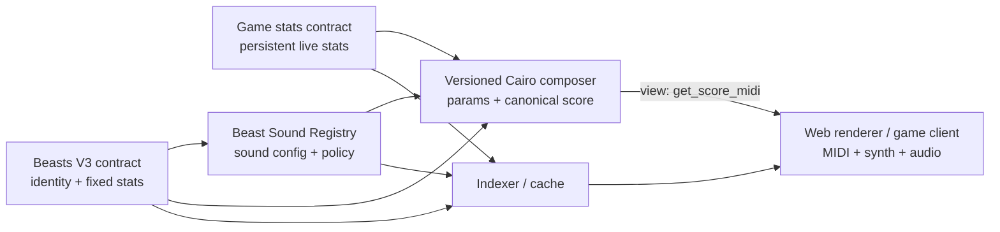
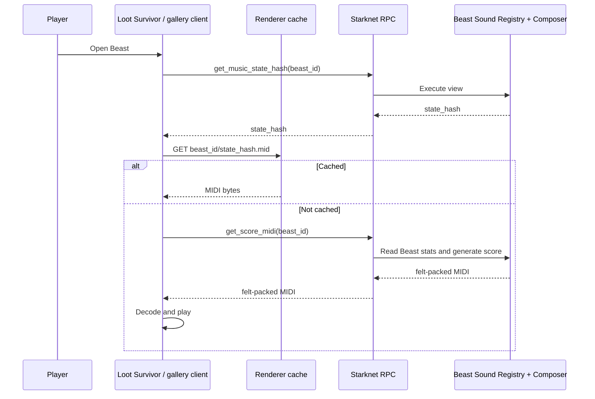

# Loot Survivor - Beasts V3 Living Sound Technical Spec

Created: 2026-06-13  
Status: Proposal / conversation draft  
Tags: #loot-survivor #beasts-v3 #starknet #sound #generative-music #nft #koji

Related: [[Loot Survivor - Beast Trait to Canon Mapping]], [[01 - Generative Core]], [[Melodic Canon]], [[Aesthetic Profiles]], [[30 - Rendering Strategy|Rendering Strategy]], [[09 - Token URI Capacity]], [[Starknet-Solana (Koji) - Simple Breakdown]]

---

## Proposal in one paragraph

Add `Sound` as an optional Beasts V3 capability alongside Shiny and Animated. Each sound-enabled Beast receives an immutable `sound_seed`, theme, engine version, and adaptation policy when it is created or collected. These values establish the Beast's recognizable musical identity. A deterministic Cairo composer then reads the Beast's fixed stats and persistent live stats, maps them into bounded musical parameters, and exposes the current canonical score through Starknet view functions. The chain stores the small identity/configuration tuple and authoritative game stats, not audio files or every MIDI note. A browser or renderer calls the view, converts the canonical score/MIDI into audible sound, and caches it by a state hash.

## Direct answer: where does the variation reside?

Variation should be split across three layers:

| Variation layer | Source | Where it lives | Effect |
|---|---|---|---|
| **Beast identity** | `sound_seed`, `theme_id`, fixed stats | Onchain, immutable | The recognizable motif, mode, canon family, and core instrumentation |
| **Living evolution** | Persistent battle stats and checkpointed rank tier | Onchain, mutable game state | Bounded changes to harmony, density, orchestration, form, and intensity |
| **Audio performance** | SoundFont, synth patch, reverb, mastering | Offchain renderer, content-addressed where possible | Turns the canonical score into polished audio |

The canonical musical variation is therefore **decided onchain**. The final audio waveform is **rendered offchain**.

Do not mix all current stats into a new random seed on every playback. That would make the Beast lose its musical identity whenever one stat changes. Keep one immutable root seed, then use stats as controlled transformation parameters.

---

## Product recommendation

### V1 recommendation: Sound is a feature of the Beast

For Beasts V3, the Beast should remain the collectible and composable game object. Sound should be an attached capability, not a separate NFT required for playback.

This matches the proposed unified collection:

- Shiny changes how a Beast looks.
- Animated changes how a Beast moves.
- Sound changes how a Beast is heard.
- All three remain capabilities of the same Beast token.

The "dark musical canon" is the Beast's living theme. The seed and sound configuration are stored against the Beast ID.

### Optional later extension: collectible Sound Modules

If separate musical NFTs are still desirable, introduce them later as attachable `SoundModule` or `SoundSigil` tokens:

- A Sound Module represents a reusable composition recipe, theme family, or creator license.
- A Beast references `sound_module_id`.
- The Beast still stores its own root seed, so two Beasts using the same module remain distinct.
- Attachment and detachment rules must be explicit, especially when either token transfers.

This is more complex and should not block the first Beasts V3 integration.

---

## Design goals

1. Every sound-enabled Beast has a distinct but recognizable theme.
2. The theme evolves as the Beast's persistent network history changes.
3. Identical onchain inputs always produce identical canonical score bytes.
4. The generated output remains bounded in size and Starknet execution cost.
5. Sound remains optional for Beast creators.
6. New Beast creators can select approved sound recipes without writing Cairo.
7. Loot Survivor and other onchain games can query the same composable sound state.
8. The site, indexer, and renderer improve delivery but are not the source of truth.

## Non-goals for V1

- Storing WAV/MP3 files onchain.
- Running a high-quality synthesizer onchain.
- Allowing arbitrary creator-supplied Cairo callbacks during score generation.
- Making transient in-battle health part of the permanent NFT theme.
- Giving every individual combat event a completely new composition.

---

## Recommended architecture

Use three onchain concerns and one offchain delivery layer:



### Why use a separate Sound Registry?

A `BeastSoundRegistry` keeps the core Beasts collection unified while making Sound an optional, versioned capability:

- Beasts V3 does not need to store large or rapidly evolving music-specific structs.
- Sound can be added without changing Shiny or Animated behavior.
- Composition engines can be versioned independently.
- Other games can query a stable sound interface.
- Creator authorization and premium-feature fees have one clear home.

If Beasts V3 already has a generic capability/component registry, use that instead of deploying a sound-specific registry.

---

## Onchain vs offchain responsibilities

### Onchain: canonical truth

Store or expose:

- Beast ID and creator.
- Immutable root `sound_seed`.
- `theme_id`.
- `engine_id` and `engine_version`.
- `adaptation_policy_id`.
- Optional `instrument_pack_id` and its content hash.
- Fixed Beast stats.
- Persistent live stats.
- Checkpointed rank tier or rank epoch.
- Current normalized music state hash.
- Pure views that derive music parameters and canonical score/MIDI.
- Events for configuration and meaningful state changes.

### Offchain: delivery and timbre

Handle:

- Indexing and sorting sound-enabled Beasts.
- Calling Starknet views.
- Deserializing felt-packed MIDI.
- Tone.js/WebAudio or game-engine playback.
- SoundFonts, synth patches, samples, reverb, and mastering.
- CDN caching keyed by the canonical state hash.
- Optional IPFS/Arweave mirrors of rendered MIDI/audio.

The renderer may fail or disappear without changing what the Beast's canonical music is.

---

## Data model

Field names should be adapted to the final Beasts V3 interfaces. The important requirement is the separation between immutable sound identity and mutable music state.

```cairo
#[derive(Copy, Drop, Serde, starknet::Store)]
struct BeastSoundConfig {
    enabled: bool,
    sound_seed: felt252,
    theme_id: u16,
    engine_id: felt252,
    engine_version: u16,
    engine_contract: ContractAddress,
    engine_class_hash: felt252,
    adaptation_policy_id: u16,
    instrument_pack_id: felt252,
    instrument_pack_hash: felt252,
    composer_recipient: ContractAddress,
}

#[derive(Copy, Drop, Serde)]
struct BeastMusicState {
    level: u16,
    health_class: u8,
    adventurers_defeated_bucket: u8,
    times_defeated_bucket: u8,
    encounter_bucket: u8,
    rank_tier: u8,
    rank_epoch: u32,
}

#[derive(Copy, Drop, Serde)]
struct CompositionParams {
    theme_id: u16,
    canon_config_id: u16,
    profile_id: u16,
    voice_count: u8,
    phrase_length: u16,
    density: u8,
    ornament_density: u8,
    tension_tier: u8,
    register_center: u8,
    tempo_bpm: u16,
    instrumentation_tier: u8,
}
```

### Minimal persistent storage per Beast

At minimum:

```text
sound_seed
theme_id
engine_id + engine_version + engine_contract + engine_class_hash
adaptation_policy_id
instrument_pack_id/hash
composer_recipient
```

The current score should not be stored. It is derived from the sound config plus current authoritative Beast stats.

---

## Seed derivation and variation model

### Root sound seed

Freeze the root seed when Sound is attached:

```text
sound_seed = Poseidon(
  "BEAST_SOUND_V1",
  chain_id,
  beasts_contract_address,
  beast_id,
  creator_sound_salt
)
```

Do not include the current owner or minter address. Ownership changes must not alter the Beast's musical identity.

### How the Sound roll fits collection

If Sound is rolled at collection like Shiny and Animated:

- The collection's authoritative randomness decides `sound_enabled`.
- A Sound-enabled result freezes `sound_seed` and the selected approved theme/module.
- The roll should emit the final Sound configuration so it can be independently verified.
- Later battle stats may evolve the arrangement, but they never change whether the Beast won the original Sound effect.

For creator-added Beasts, the creator can decide whether Sound is available and which approved theme/module family the collection-time roll may select.

### Stable identity, controlled evolution

Derive independent sub-seeds for stable musical layers:

```text
motif_seed         = Poseidon(sound_seed, "MOTIF")
canon_seed         = Poseidon(sound_seed, "CANON")
orchestration_seed = Poseidon(sound_seed, "ORCHESTRATION")
ornament_seed      = Poseidon(sound_seed, "ORNAMENT")
```

Persistent stats should primarily select or scale bounded parameters. They should not replace `sound_seed`.

Bad:

```text
score_seed = Poseidon(sound_seed, every_current_stat)
```

This re-randomizes the whole composition whenever any stat changes.

Recommended:

```text
base_theme = generate_theme(motif_seed, theme_id)
params = map_stats_to_params(fixed_stats, normalized_live_stats, policy_id)
score = arrange_theme(base_theme, canon_seed, params)
```

The Beast keeps its melody while its history changes the arrangement.

---

## Stat normalization

Raw live counters grow forever and may change after every battle. Map them into small deterministic buckets before composition.

Recommended logarithmic bucket:

```text
bucket(n) = min(MAX_BUCKET, floor(log2(n + 1)))
```

Example:

| Raw count | Bucket |
|---:|---:|
| 0 | 0 |
| 1 | 1 |
| 2-3 | 2 |
| 4-7 | 3 |
| 8-15 | 4 |
| 16-31 | 5 |
| 32-63 | 6 |
| 64+ | 7 |

This creates audible milestone changes without invalidating the soundtrack after every encounter.

### Rank handling

Do not derive music from an expensive live global sort inside `get_score`.

Use one of:

1. A checkpointed `rank_tier` written by the authoritative ranking system.
2. A rank tier derived from explicit score thresholds.
3. A seasonal `rank_epoch` plus tier.

Recommended tiers: `Unranked`, `Bronze`, `Silver`, `Gold`, `Mythic`, `Legendary`.

The exact numeric leaderboard position belongs in the indexer/UI. The small rank tier belongs in canonical music state.

---

## Beast trait bounds → musical canon mapping

Full numerical bounds, species table (75 rows), prefix/suffix decomposition, dark key policy, ornament policies, and uniqueness proof for **93,225** distinct canon identities: **[[Loot Survivor - Beast Trait to Canon Mapping]]**.

Summary:

| Beast trait | Count | Musical layer |
|---|---:|---|
| Species | 75 | `canon_config_id` + tier complexity ceiling |
| Name variant | 1,243 | Prefix → dark key; suffix → ornament policy |
| Visual rarity | 4 | Performance layer (tempo rubato, v1/v2 ornament path) |
| Weapon weakness | 3 | Rhythm template + harmonic aggression |

---

## Suggested stat-to-music mapping

This mapping is a starting artistic policy, not a fixed requirement.

| Beast input | Musical control | Result |
|---|---|---|
| `theme_id` | Base motif family and dark aesthetic profile | Every Beast species/type has a recognizable world |
| `sound_seed` | Motif contour, canon interval, register details | Every individual Beast is distinct |
| Fixed `level` | Voice count and contrapuntal complexity | Higher-level Beasts sound more elaborate |
| Fixed `health` or health class | Phrase length and low-register weight | Larger/healthier Beasts feel heavier |
| Adventurers defeated | Tension, percussion intensity, ornament density | A successful Beast becomes more dangerous sounding |
| Times Beast defeated | Fracture, rests, altered cadence probability | Defeats leave audible scars without erasing the theme |
| Encounter count | Form length or development stage | Older Beasts gain developed variations |
| Rank tier | Instrumentation tier and final cadence | High-ranked Beasts receive premium sonic presence |

All mappings must be clamped. For example, rank may add instruments, but it must never create an unbounded number of tracks.

### Dark canon palette

The existing [[Melodic Canon]] and [[Aesthetic Profiles]] engine already provides suitable deterministic families:

- Phrygian cadential canon.
- Bartok axis canon.
- Octatonic axis canon.
- Bitonal split canon.
- Soft chromatic cluster canon.
- Ligeti cluster or micro-canon.
- Altered dominant b9 canon.
- Canon per tonos for endlessly rising/drifting Beasts.

A `theme_id` can select a curated family, while the Beast seed selects the specific motif and arrangement inside it.

---

## Canonical current state

First define an immutable configuration hash:

```text
sound_config_hash = Poseidon(
  sound_seed,
  engine_id,
  engine_version,
  engine_contract,
  engine_class_hash,
  theme_id,
  adaptation_policy_id,
  instrument_pack_hash
)
```

Then define:

```text
music_state_hash = Poseidon(
  sound_config_hash,
  level,
  health_class,
  adventurers_defeated_bucket,
  times_defeated_bucket,
  encounter_bucket,
  rank_tier,
  rank_epoch
)
```

The renderer and CDN cache by:

```text
(chain_id, beasts_contract, beast_id, music_state_hash)
```

If a raw counter changes without crossing a bucket boundary, `music_state_hash` stays the same and the audible theme does not need to be regenerated.

If the MIDI cache and final rendered-audio cache are separate, key the audio cache by `(music_state_hash, instrument_pack_hash, renderer_version)`.

---

## Proposed Starknet interface

```cairo
#[starknet::interface]
trait IBeastSound<TContractState> {
    // Configuration
    fn has_sound(self: @TContractState, beast_id: u256) -> bool;
    fn get_sound_config(
        self: @TContractState, beast_id: u256
    ) -> BeastSoundConfig;

    // Canonical current state
    fn get_music_state(
        self: @TContractState, beast_id: u256
    ) -> BeastMusicState;
    fn get_music_state_hash(
        self: @TContractState, beast_id: u256
    ) -> felt252;
    fn get_composition_params(
        self: @TContractState, beast_id: u256
    ) -> CompositionParams;

    // Canonical materialization
    fn get_score_hash(
        self: @TContractState, beast_id: u256
    ) -> felt252;
    fn get_score_encoding(
        self: @TContractState, beast_id: u256
    ) -> Span<felt252>;
    fn get_score_midi(
        self: @TContractState, beast_id: u256
    ) -> Span<felt252>;

    // Preview a valid hypothetical state without changing the Beast.
    fn preview_score_midi(
        self: @TContractState,
        beast_id: u256,
        proposed_state: BeastMusicState
    ) -> Span<felt252>;
}
```

`get_score_midi` is the playback entry point. It reads the current Beast state, derives parameters, runs the versioned Cairo composer, and returns packed MIDI bytes.

`preview_score_midi` is useful for creator tooling and showing how a new Beast could sound at future ranks. Preview output is non-authoritative unless its state matches `get_music_state`.

---

## Write interface and authorization

```cairo
#[starknet::interface]
trait IBeastSoundAdmin<TContractState> {
    fn attach_sound(
        ref self: TContractState,
        beast_id: u256,
        config: BeastSoundConfig
    );

    fn checkpoint_sound(ref self: TContractState, beast_id: u256);
}
```

Recommended rules:

- Sound can be attached only during Beast creation or by the authorized Beast creator.
- Root seed, theme, engine version, and policy become immutable after activation.
- A migration to a new engine requires an explicit versioned action and event.
- Instrument packs must be approved or content-addressed.
- Arbitrary external composer callbacks are not allowed in V1.

If Beasts V3 supports creator-owned extension rights, use those rights as the authorization source instead of duplicating ownership logic.

---

## Events and indexing

```cairo
#[derive(Drop, starknet::Event)]
struct BeastSoundAttached {
    #[key]
    beast_id: u256,
    #[key]
    engine_id: felt252,
    theme_id: u16,
    sound_seed: felt252,
    composer_recipient: ContractAddress,
}

#[derive(Drop, starknet::Event)]
struct BeastSoundStateChanged {
    #[key]
    beast_id: u256,
    old_state_hash: felt252,
    new_state_hash: felt252,
    rank_epoch: u32,
}

#[derive(Drop, starknet::Event)]
struct BeastSoundCheckpointed {
    #[key]
    beast_id: u256,
    state_hash: felt252,
    score_hash: felt252,
    level: u16,
    health_class: u8,
    adventurers_defeated_bucket: u8,
    times_defeated_bucket: u8,
    encounter_bucket: u8,
    rank_tier: u8,
    rank_epoch: u32,
}
```

The game contract should emit sufficient combat/stat events for an indexer to know when a normalized bucket or rank tier changes. It is not necessary to store a sortable list of all sound-enabled Beasts onchain.

A checkpoint must include the normalized state values, not only their hash. The hash proves identity; the values make historical replay possible.

`BeastSoundStateChanged` is optional. Emit it only if the game calls a Sound integration hook when a normalized tier changes. Otherwise, the indexer derives the same transition from the game's authoritative combat/stat events.

### How Sound variants get sorted

Use an indexer for discovery and sorting:

- Filter: Sound enabled, theme family, composer, engine version.
- Sort: rank tier, battle record, latest sound change, score rarity traits.
- Group: music state hash, canon family, aesthetic profile.

Onchain contracts provide authoritative values and events. The indexer provides fast global queries.

---

## Playback flow



In a browser, the MIDI can be played with Tone.js/WebAudio. In the game, the same MIDI events can drive the existing audio engine.

---

## Canonical theme vs in-battle soundtrack

Treat these as related but distinct outputs.

### Canonical Beast theme

- Uses immutable identity plus persistent, normalized stats.
- Deterministic and suitable for NFT metadata/gallery playback.
- Changes only at meaningful milestones.
- Has a canonical `music_state_hash` and `score_hash`.

### Runtime combat performance

- May react instantly to current HP, combat phase, player actions, or room danger.
- Can add stems, filters, tempo ramps, and transitions in the client.
- Does not redefine the canonical NFT score.
- May be reproduced from a recorded battle event log if desired.

This separation avoids turning temporary HP changes into permanent NFT metadata churn while still allowing highly reactive game music.

---

## Metadata example

```json
{
  "name": "Beast #418",
  "attributes": [
    {"trait_type":"Sound","value":"Enabled"},
    {"trait_type":"Sound Theme","value":"Phrygian Cadential Canon"},
    {"trait_type":"Sound Rank Tier","value":"Mythic"},
    {"trait_type":"Sound Engine","value":"Koji Beast Sound v1"},
    {"trait_type":"Voice Count","value":4},
    {"trait_type":"Tension Tier","value":3}
  ],
  "properties": {
    "sound_seed": "0x...",
    "music_state_hash": "0x...",
    "score_hash": "0x...",
    "midi_derived_from": "starknet_view:get_score_midi",
    "sound_is_living": true
  },
  "animation_url": "https://renderer.example/beasts/418"
}
```

Because the sound is living, marketplaces may cache stale metadata. The game and official gallery should query current state directly. Checkpoint events can provide historically stable versions.

---

## Historical versions and checkpoints

A living score creates an important product question: can someone replay how the Beast sounded before it reached its current state?

Recommended V1:

- `get_score_midi(beast_id)` returns the current canonical theme.
- `checkpoint_sound(beast_id)` emits the normalized state, `state_hash`, and `score_hash` at meaningful milestones.
- An indexer stores checkpoint block numbers and normalized states.
- A renderer can replay historical checkpoints from the recorded state.

Do not checkpoint every fight. Checkpoint when:

- A stat bucket changes.
- Rank tier changes.
- The Beast reaches a major level/milestone.
- The owner explicitly pays to memorialize a version.

An optional future "edition mint" could mint a checkpoint as a separate immutable musical artifact without changing the living Beast.

---

## Creator onboarding and premium Sound

When a creator adds a Beast, expose:

```text
Sound: None | Curated Theme | Custom Approved Theme
Theme family: [curated dark canon families]
Adaptation policy: [approved mappings]
Instrument pack: [approved/content-addressed packs]
Creator salt: [optional]
```

Recommended premium flow:

1. Creator previews seeds and future-rank states offchain using the same deterministic engine.
2. Creator selects a theme family and policy.
3. `attach_sound` records the immutable configuration and fee split.
4. `BeastSoundAttached` is emitted.
5. Any compatible game or gallery can immediately play the Beast.

The initial premium fee can split between the Beasts protocol, composer/tooling provider, and Beast creator. Keep fee logic separate from score generation.

---

## Versioning and composability

Every sound config pins an engine version:

```text
engine_id      = "KOJI_BEAST_SOUND"
engine_version = 1
```

Rules:

- Same config + same normalized Beast state + same engine version = same score.
- Engine behavior must not silently change under an existing version.
- New musical behavior ships as a new engine version.
- Old versions remain callable for historical playback.
- Golden fixtures test known Beast states against expected params and score hashes.

Other games only need:

```text
has_sound(beast_id)
get_music_state_hash(beast_id)
get_score_midi(beast_id)
```

They do not need to understand every internal composition rule.

---

## Execution and security constraints

The composer must enforce:

- Maximum number of voices.
- Maximum phrase length.
- Maximum note/event count.
- Maximum ornament density.
- Fixed supported MIDI message types.
- Integer-only deterministic computation.
- No unbounded loops based on raw live counters.
- No arbitrary external contract callbacks during generation.
- No owner/minter address in permanent musical identity.

If full MIDI generation is too heavy for reliable Starknet RPC views:

1. Keep `get_composition_params` and `get_score_hash` canonical onchain.
2. Recompute MIDI in the open-source TypeScript/game client implementation.
3. Verify the recomputed score against `score_hash`.
4. Treat cached or IPFS audio as a mirror, never as the sole source of truth.

This fallback preserves verifiability while lowering RPC execution pressure.

---

## Suggested phased delivery

### Phase 0: musical proof

- Select 4-6 dark canon theme families.
- Implement `map_stats_to_params`.
- Produce examples for low/high level, victory/defeat history, and rank tiers.
- Confirm that a Beast remains recognizable across state changes.

### Phase 1: minimal onchain integration

- Add `BeastSoundRegistry`.
- Store config and immutable seed.
- Read fixed/live stats from authoritative contracts.
- Implement `get_music_state`, `get_composition_params`, and `get_music_state_hash`.
- Render score offchain from canonical params.

### Phase 2: canonical Cairo score

- Integrate the Koji/Cairo canon engine.
- Implement `get_score_hash` and `get_score_midi`.
- Add golden fixtures and resource benchmarks.
- Add indexer cache invalidation from state-change events.

### Phase 3: creator platform

- Add Beast creator preview UI.
- Add premium Sound fee splits.
- Add approved custom themes/instrument packs.
- Add optional checkpoint edition mints or attachable Sound Modules.

---

## Open decisions for the Beasts V3 builder

1. Where will creator-authorized optional capabilities live in Beasts V3: directly on the Beast, or in a generic capability registry?
2. Which contract is authoritative for cumulative wins, losses, encounters, and rank?
3. Is rank a continuously changing global position or a checkpointed tier?
4. Can Sound be attached only at Beast creation, or later by the Beast creator/owner?
5. Should a Sound config be immutable forever, or explicitly migratable between engine versions?
6. Should milestone checkpoints be events only, or separately mintable immutable music editions?
7. Does the protocol want an initial premium attachment fee, a creator tool fee, or both?

---

## Concise message back to the builder

I think the cleanest model is to make Sound an optional capability of the unified Beast rather than a separate NFT in the first version. At creation/collection, we store a small immutable sound config on Starknet: a root seed, theme ID, composer engine/version, and an adaptation policy. That seed gives each Beast its recognizable motif and dark canon identity.

The living variation also comes from onchain state, but I would not hash every live stat into a brand-new random score. Instead, the composer reads the Beast's fixed stats and persistent live stats, normalizes the growing counters into bounded tiers, and maps those tiers onto musical controls such as voice count, tension, density, form, and instrumentation. The motif stays recognizable while the arrangement evolves with the Beast's history.

The chain stores the seed/config and already-authoritative game stats. A Cairo view derives the current composition parameters and ideally the canonical MIDI/score. The browser or game client handles synthesis and polished audio playback. Indexers handle global filtering and sorting; they are not the source of truth.

So the short version is: **identity and variation rules onchain, score derived through a deterministic view, final audio rendered offchain**. We can start with a separate `BeastSoundRegistry` that attaches this capability without bloating the core V3 collection, then later add creator tooling or separately collectible Sound Modules if that becomes useful.

---

## References

- Loot Survivor describes itself as an immutable onchain Starknet game and documents its Cairo contracts and indexer architecture: <https://github.com/Provable-Games/loot-survivor>
- Starknet/Cairo view functions can read contract storage and are callable through `starknet_call`: <https://www.starknet.io/cairo-book/ch101-02-contract-functions.html>
- Existing project architecture for seed-only storage and deterministic playback: [[09 - Token URI Capacity]] and [[30 - Rendering Strategy|Rendering Strategy]]
